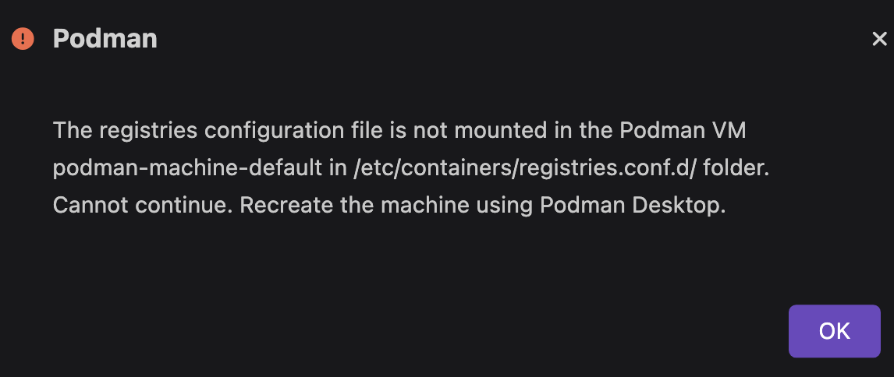
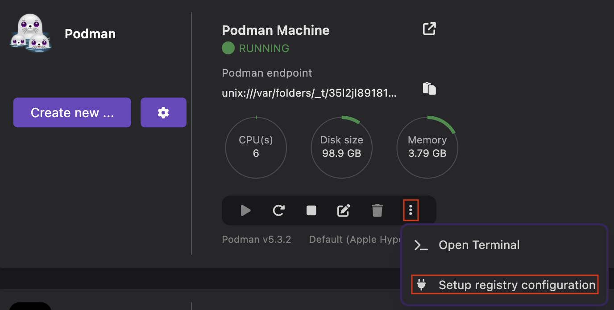

# Configure a mirror registry with Podman Desktop

Lower rate limits imposed on the Docker Hub End-User License Agreement (EULA) made it difficult for community members to access the `docker.io` images frequently. A simple solution to this problem is to configure a mirror for the `docker.io` registry in the `registries.conf` file. This way, they can access the Docker resources whenever needed.

With the Podman Desktop UI, you can add registry locations and configure their mirrors easily. Configuring a mirror redirects a registry to another location, enabling you to use its content. For example, if you have configured `ghcr.io` as a mirror for `docker.io` and try to pull a resource, Podman Desktop pulls the resource from `ghcr.io` instead of `docker.io`.

The blog covers how to configure a mirror for the `docker.io` registry.

## Prerequisites

- Upgrade to the latest version of Podman.
- [Recreate your Podman machine](/docs/podman/creating-a-podman-machine). Otherwise, you get a notification when you set up your registry configuration:
  

## Configuring: A mirror for `docker.io`

1. Go to the **Settings > Resources** page.
1. Select **More Options > Setup registry configuration** in the Podman tile. A command palette opens.
   
1. Set up your registry configuration:
1. Select the **Add registry configuration** option from the command palette.
   
1. Type the location of the registry, such as `docker.io`, and press the `Enter` key. The `docker.io` registry is added to the palette.
   
1. Select `docker.io` from the command palette.
1. Type the location where you want to mirror the registry, such as `ghcr.io`, and press the `Enter` key. The entry for the `docker.io` registry shows the location where it is mirrored.
   
1. Select the `End configuring registries` option to end registry configuration.
   

## Verifying: the mirror

There is no direct way to verify the mirror configuration from the UI. But, you can use the CLI for verification.

1. Start an interactive session with the default Podman machine:

```sh
$ podman machine ssh <machine_name>
```

2. Pull an invalid image from `docker.io`.

```sh
$ podman pull docker.io/invalid
```

An error message appears in the terminal indicating a failure to pull the image from the mirror. You receive the error message: `Mirrors have also failed`.
