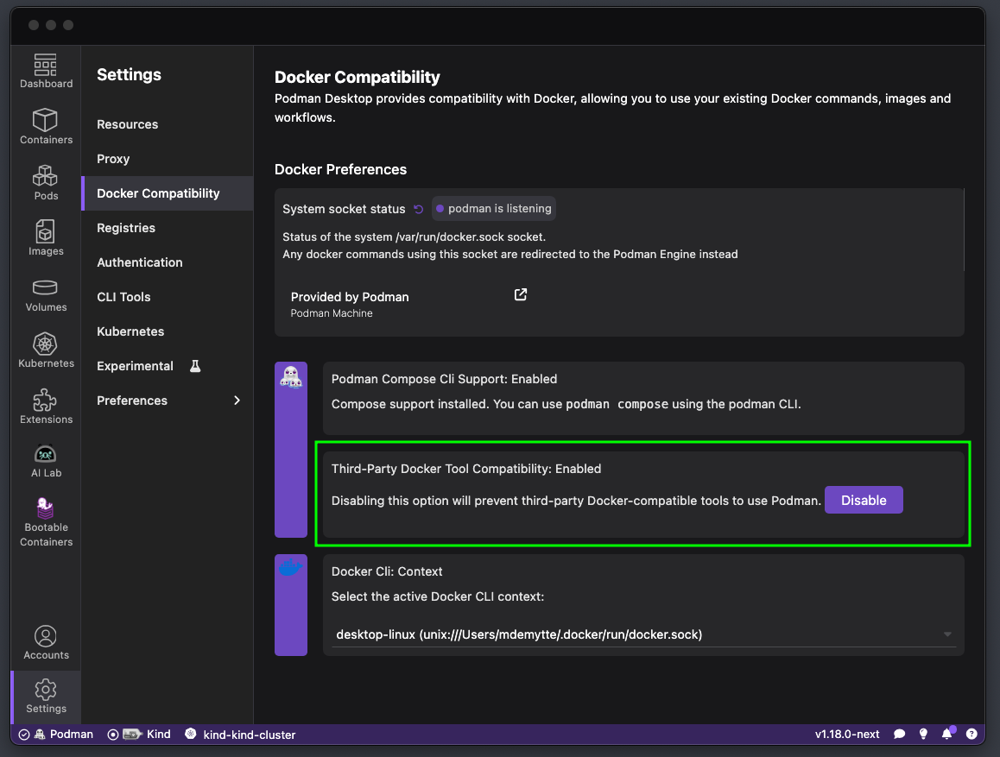
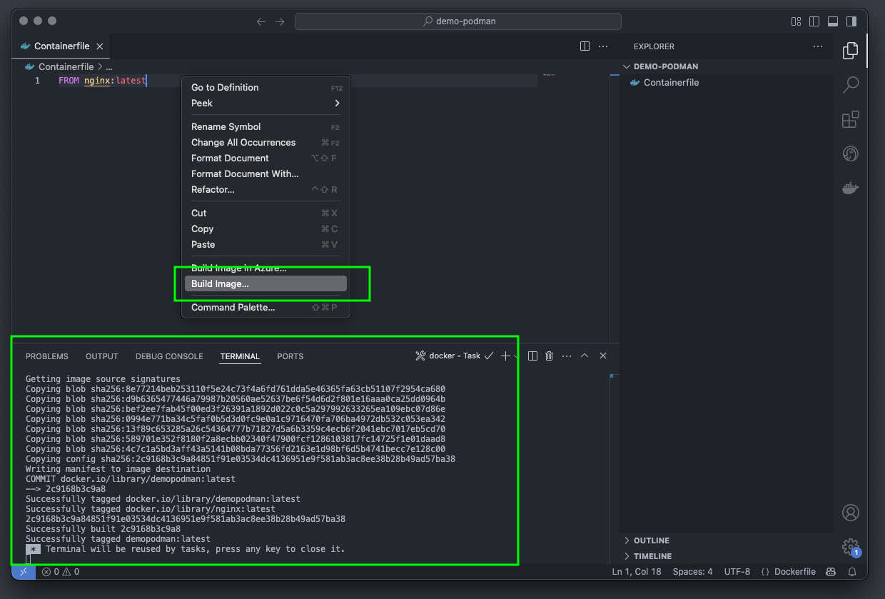
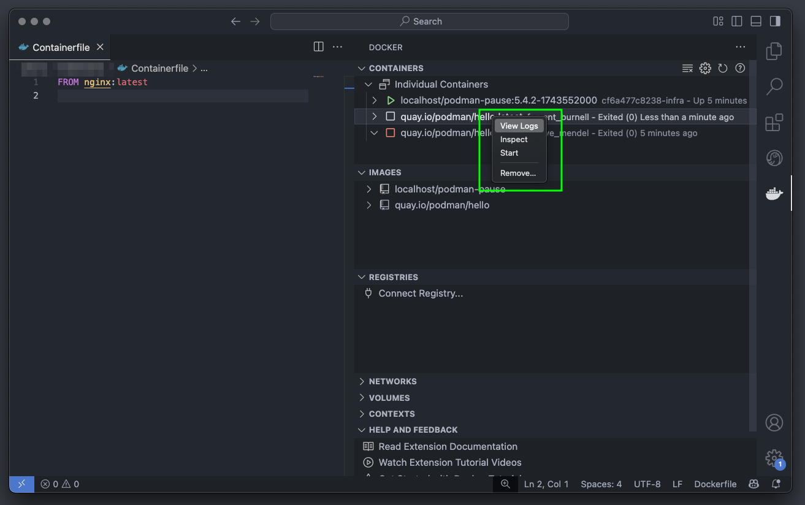
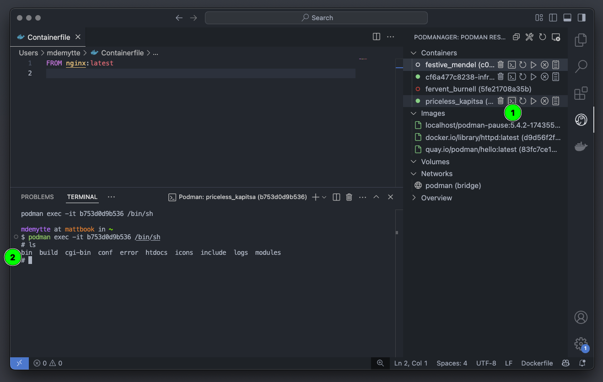
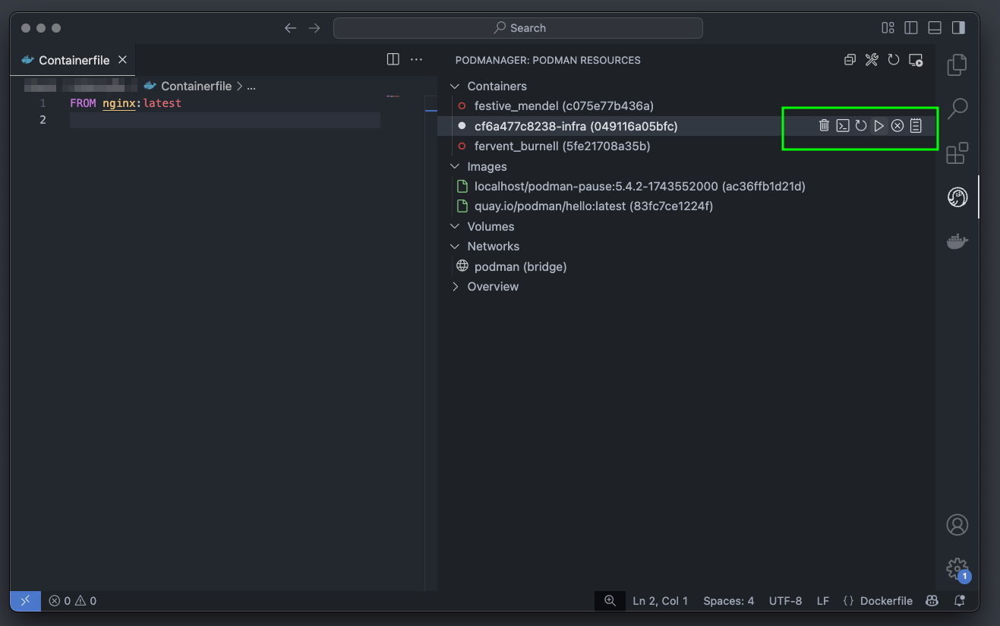

Developing containerized applications can sometimes feel complex, but with the right tools, it can be a smooth and efficient process. In this blog post, we'll explore how to leverage the power of Visual Studio Code (VS Code) together with Podman and Podman Desktop to streamline your container development workflow. We'll cover setting up the necessary tools and using the VS Code extensions for a seamless experience.

## VS Code: Your IDE for Container Development

VS Code is a popular and versatile code editor that can be extended to enhance its functionality. For container development, several excellent extensions integrate seamlessly with Podman.

## Prerequisites

Before we begin, ensure you have the following installed:

- **Podman:** Follow the installation instructions on the [official website](https://podman.io/).
- **Podman Desktop:** Download and install Podman Desktop from the [official website](https://podman-desktop.io/downloads).
- **Visual Studio Code:** Download and install VS Code from the [official website](https://code.visualstudio.com/download).

## **VS Code Extensions**

To integrate VS Code with Podman, we have 2 extensions as options:

1. [**Microsoft’s Docker extension**](https://marketplace.visualstudio.com/items?itemName=ms-azuretools.vscode-docker)**:** Since Podman is entirely compatible with the Docker API we are to use the "Docker" extension. The "Docker" extension provides excellent support for container-related tasks, including building images, managing containers, and working with Dockerfiles. It intelligently detects Podman if Docker isn't available. It might have [changed its name](https://techcommunity.microsoft.com/blog/AppsonAzureBlog/major-updates-to-vs-code-docker-introducing-container-tools/4400609) by the time you read this.
2. [**Pod Manager**](https://marketplace.visualstudio.com/items/?itemName=dreamcatcher45.podmanager): This extension was created by one of the members of our community and is completely open source. It is designed to help you manage Podman containers, images, volumes, and networks directly from the VS Code interface.

Let's install them one by one.

### Option 1: Microsoft’s Docker extension

To install the extension:

1. Open VS Code.
2. Click on the Extensions icon in the Activity Bar (or press `Ctrl+Shift+X` or `Cmd+Shift+X`).
3. Search for "Docker" and install the extension by Microsoft.

#### Configuring VS Code for Podman

The Docker extension usually automatically detects Podman if Docker isn't running, by looking at the `DOCKER_HOST` environment variable. In Podman Desktop navigate to Settings \> Docker Compatibility \> Third-Party Tool Compatibility and make sure the option is enabled. It’s possible that if you installed through `brew` that this is not correctly set.

### Option 2: Pod Manager

To install the extension:

1. Open VS Code.
2. Click on the Extensions icon in the Activity Bar (or press `Ctrl+Shift+X` or `Cmd+Shift+X`).
3. Search for "Pod Manager" and install the extension by dreamcatcher45.

## Using the VS Code Extensions

Now that we have the extensions installed and configured, let's see how to use them.

### Working with Containerfiles and Dockerfiles

Both extensions provide syntax highlighting, code completion, and linting for Containerfiles and Dockerfiles. Open a Containerfile in VS Code, and you'll immediately benefit from these features.

You can also build images directly from VS Code:

1. Right-click on the Containerfile in the Explorer view.
2. Select "Build Image".
3. VS Code will prompt you for an image name and tag.
4. The extension will then build the image using Podman.

### Managing Containers

The extensions also allow you to manage containers directly from VS Code. You can start, stop, restart, and remove containers, as well as view their logs and inspect their configuration.

To view the container logs:

1. Click on the Docker icon in the Activity Bar.
2. You'll see a list of your containers, images, and networks.
3. Right-click on a container to perform actions.

Similarly using the Pod manager extension we can visually inspect containers, images, and volumes.

1. Click on the Pod manager icon in the Activity Bar.
2. You'll see a list of your containers, images, and networks.

and manage the container lifecycle.

and ofcourse troubleshoot issues with a visual interface.

## Conclusion

By combining the power of VS Code, Podman, and Podman Desktop, you can create a streamlined and efficient container development workflow. The VS Code extensions provide excellent integration with Podman, allowing you to manage containers, build images, and work with Containerfiles directly from your code editor. Podman Desktop complements this with a visual interface for managing your container environment. Embrace these tools and elevate your container development experience!
