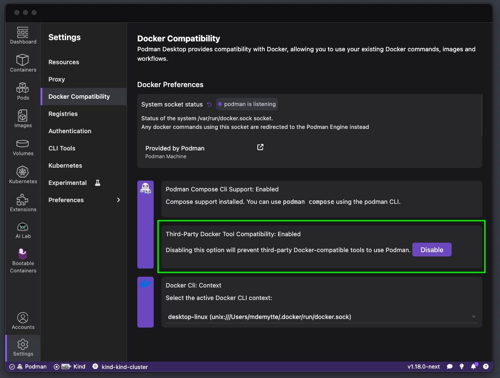
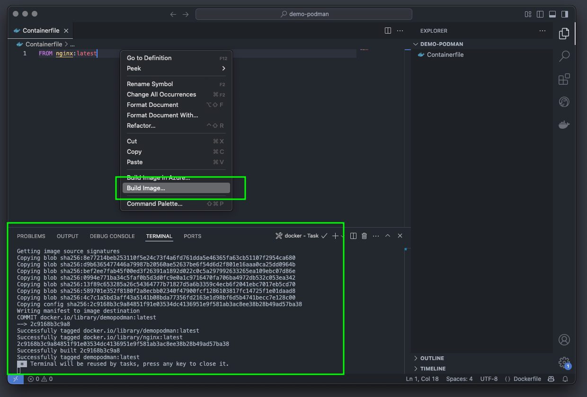
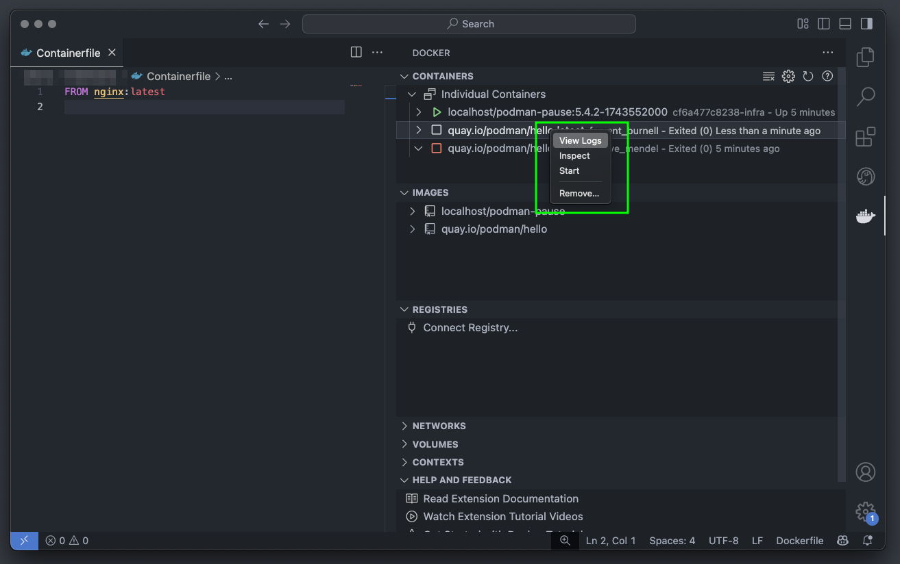
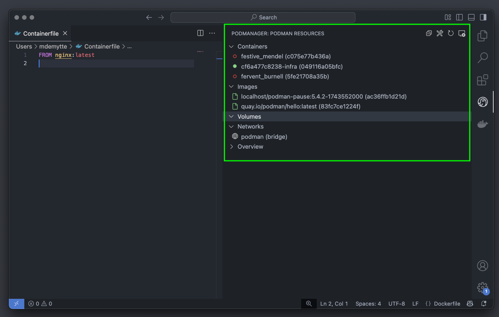
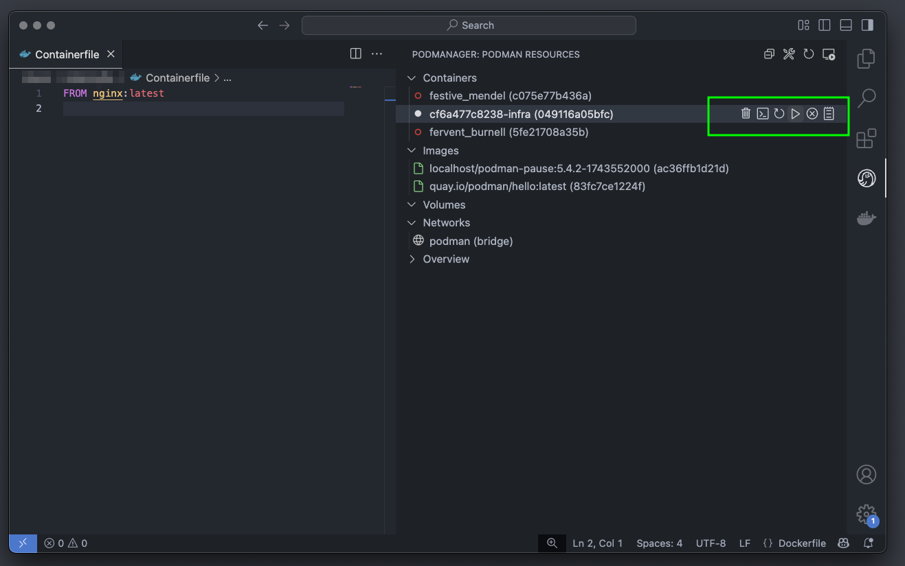
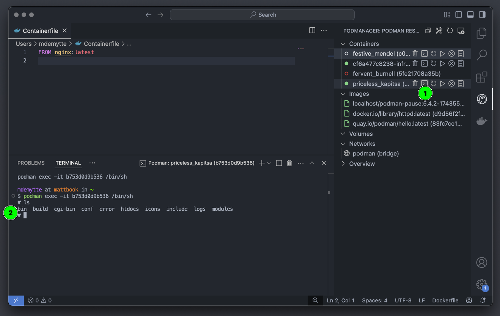

Developing containerized applications can sometimes feel complex, but with the right tools, it can be a smooth and efficient process. In this blog post, we'll explore how to leverage the power of Visual Studio Code (VS Code) together with Podman and Podman Desktop to streamline your container development workflow. We'll cover setting up and using two VS Code extensions that integrate with Podman.

## VS Code: Your IDE for Container Development

VS Code is a popular and versatile code editor that can be extended to enhance its functionality. For container development, several excellent extensions integrate seamlessly with Podman.

## Prerequisites

Before we begin, ensure you have the following installed:

- **Podman:** Follow the installation instructions on the [official website](https://podman.io/).
- **Podman Desktop:** Download and install Podman Desktop from the [official website](https://podman-desktop.io/downloads).
- **Visual Studio Code:** Download and install VS Code from the [official website](https://code.visualstudio.com/download).

## **VS Code Extensions**

To integrate VS Code with Podman, we have 2 extensions as options:

1. [**Microsoft’s Container Tools extension**](https://marketplace.visualstudio.com/items?itemName=ms-azuretools.vscode-containers)**:** The "Container Tools" extension provides excellent support for container-related tasks, including building images, managing containers, and working with Containerfiles and Dockerfiles. Microsoft [recently announced](https://techcommunity.microsoft.com/blog/AppsonAzureBlog/major-updates-to-vs-code-docker-introducing-container-tools/4400609) that they will be evolving the Docker extension into the Container Tools extension to support other tools like Podman!
2. [**Pod Manager**](https://marketplace.visualstudio.com/items/?itemName=dreamcatcher45.podmanager): This extension was created by one of the members of our community and is completely open source. It is designed to help you manage Podman containers, images, volumes, and networks directly from the VS Code interface.

While it's unlikely that you would use both extensions simultaneously, comparing them will help you understand the strengths and weaknesses of each, ultimately making it easier to select the one that best fits your needs. So for this blog post, we'll install them one by one.

### Option 1: Microsoft’s Container Tools extension

To install the extension:

1. Open VS Code.
2. Click on the Extensions icon in the Activity Bar (or press `Ctrl+Shift+X` or `Cmd+Shift+X`).
3. Search for "Container Tools" and install the extension by Microsoft.

#### Configuring VS Code for Podman

The Container Tools extension usually automatically detects Podman if Docker isn't running, by looking at the `DOCKER_HOST` environment variable. In Podman Desktop navigate to Settings \> Docker Compatibility \> Third-Party Tool Compatibility and make sure the option is enabled. Learn more about the [Docker Compatibility in our documentation](https://podman-desktop.io/docs/migrating-from-docker/managing-docker-compatibility).

### Option 2: Pod Manager

To install the extension:

1. Open VS Code.
2. Click on the Extensions icon in the Activity Bar (or press `Ctrl+Shift+X` or `Cmd+Shift+X`).
3. Search for "Pod Manager" and install the extension by dreamcatcher45.

## Using the VS Code Extensions

Now that we have the extensions installed and configured, let's see how to use them.

### Working with Containerfiles and Dockerfiles

Both extensions provide syntax highlighting, code completion, and linting for Containerfiles and Dockerfiles. Open a Containerfile in VS Code, and you'll immediately benefit from these features.

You can also build images directly from VS Code:

1. Right-click on the Containerfile in the Explorer view.
2. Select "Build Image".
3. VS Code will prompt you for an image name and tag.
4. The extension will then build the image using Podman.
5. After that you will see the built image in the sidebar.

If you are using the CLI commands to build images, you will also see them here.

### Managing Containers

The extensions also allow you to manage containers directly from VS Code. You can start, stop, restart, and remove containers, as well as view their logs and inspect their configuration.

To view the container logs:

1. Click on the Container icon in the Activity Bar.
2. You'll see a list of your containers, images, and networks.
3. Right-click on a container to perform actions.

Similarly using the Pod manager extension we can visually inspect containers, images, and volumes.

1. Click on the Pod manager icon in the Activity Bar.
2. You'll see a list of your containers, images, and networks.

and manage the container lifecycle.

and of course troubleshoot issues with a visual interface.

## Conclusion

In comparison, both extensions provide a nearly identical set of features, so it is really up to you which UI you prefer. Personally I will stick with the Pod Manager because the logo is a seal 🦭. Remember if you encounter any issues using these tools or with Podman Desktop let us know by [starting a discussion](https://github.com/podman-desktop/podman-desktop/discussions) or [creating an issue](https://github.com/podman-desktop/podman-desktop/issues).

By combining the power of VS Code, Podman, and Podman Desktop, you can create a streamlined and efficient container development workflow. The VS Code extensions provide excellent integration with Podman, allowing you to manage containers, build images, and work with Containerfiles directly from your code editor. We are excited to see that Microsoft is embracing Podman and building support into their ecosystem. Podman Desktop complements this with a visual interface for managing your container environment and will help to move from your development environment to a production Kubernetes environment. Embrace these tools and elevate your container development experience!
