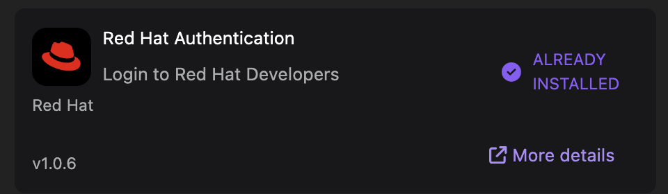
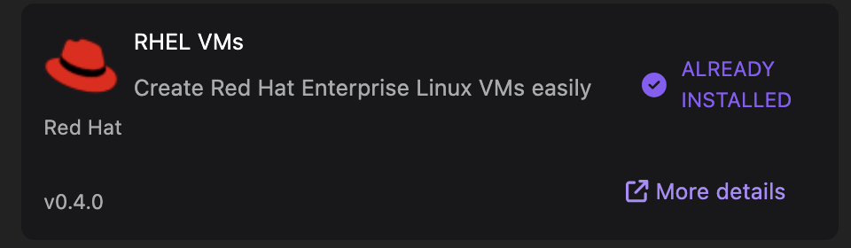
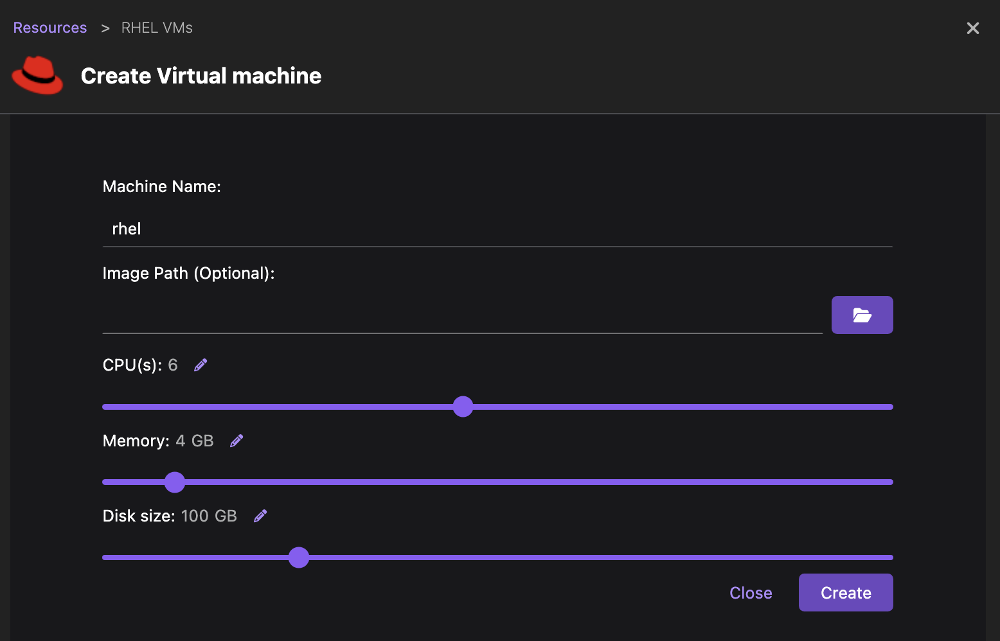
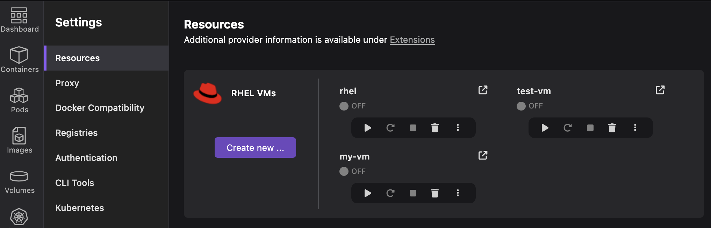

The RHEL VMs Extension for Podman Desktop simplifies accessing RHEL from Windows and macOS.

Current methods are complex. This extension aims for an intuitive, integrated approach within Podman Desktop,
easing RHEL interaction for developers by managing RHEL instances directly.

Key benefits include simplified creation/management of pre-configured RHEL VMs via a GUI,
and seamless interaction with integrated terminal access.

This extension reflects Red Hat's commitment to improving cross-platform RHEL access for development and testing,
promising increased productivity and a more consistent experience.

<!--truncate-->

---

## Installing the RHEL VMs extension

The RHEL VMs extension streamlines RHEL image installation by providing pre-configured downloads from the Red Hat repository. Accessing these images requires a Red Hat account, and therefore, the Red Hat Authentication extension must also be installed.

The Red Hat Authentication and RHEL VMs extensions are available in the Podman Desktop extensions catalog. To install them, go to the Extensions > Catalog page within Podman Desktop and proceed with the installation of each extension.

## Creating RHEL VMs

To create your first RHEL VM, navigate to the Settings page in Podman Desktop, locate the RHEL VMs section, and click "Create new…". A form is presented enabling configuration of the virtual machine. This includes specifying the virtual machine's name, allocating resources such as CPU, memory, and disk, and optionally designating an image path. If the image path is not provided, a pre-configured image compatible with your system will be downloaded from the Red Hat repository.

After clicking the “Create” button, the image is downloaded and the machine is instantiated on your system. If required, Podman Desktop will prompt you to authenticate with your Red Hat account to proceed with the image download.

## Using the VM

Back to the Resources page, you can now manage the newly created virtual machine. Functions such as starting, stopping, restarting, and deletion are available. Feel free to create as many as you want (and your system can support), and please note that, in some platforms, it is possible to start only one machine at a time.

A direct access to the RHEL system is finally provided through an auto-configured SSH connection. Terminal access is provided through the RHEL VM details page by selecting the corresponding button.

## Conclusion

Launching RHEL virtual machines serves as the initial step for developers in constructing RHEL-based applications. When combined with the BootC extension for building systems in RHEL Image Mode and the Quadlet extension for container orchestration, developers have a comprehensive toolkit for creating and deploying their applications.
