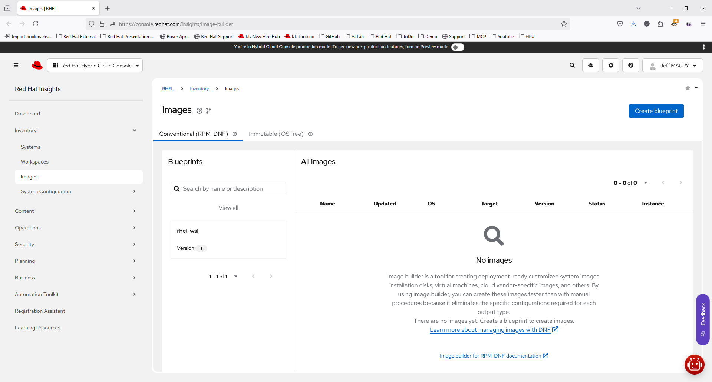
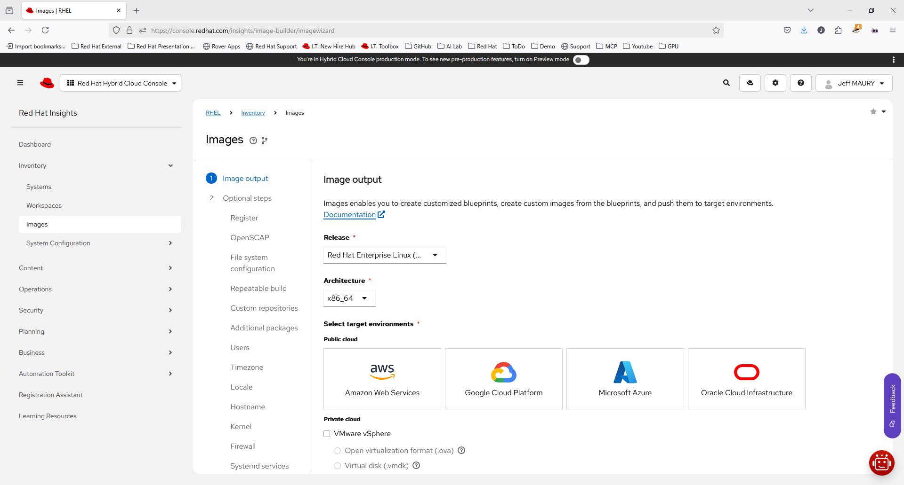
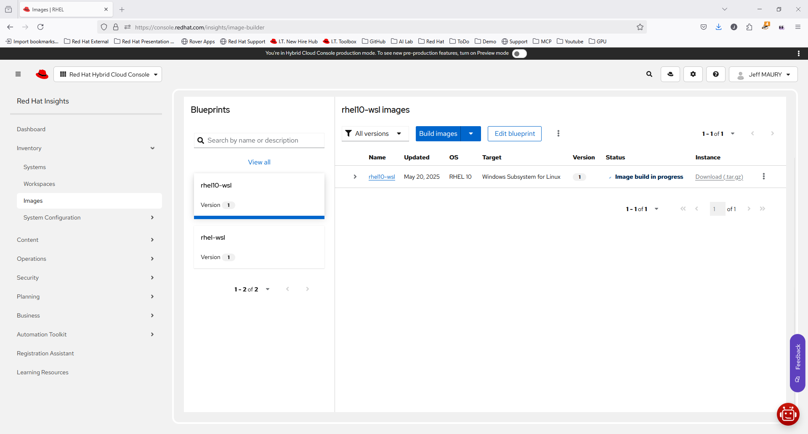
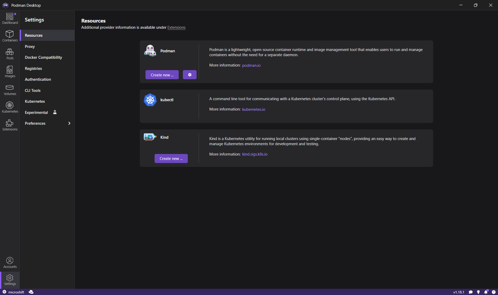
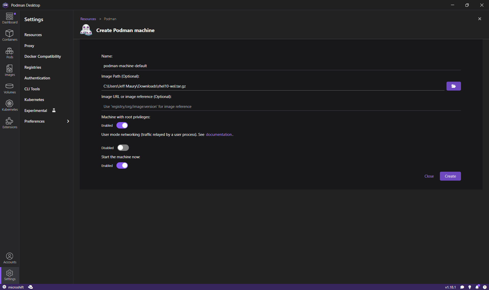
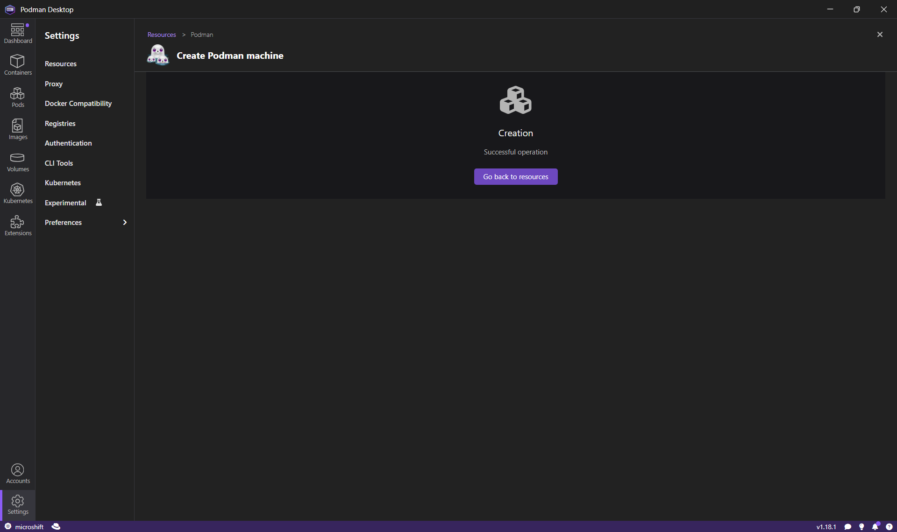
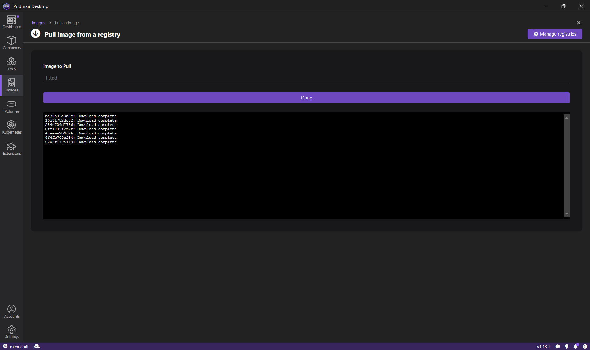
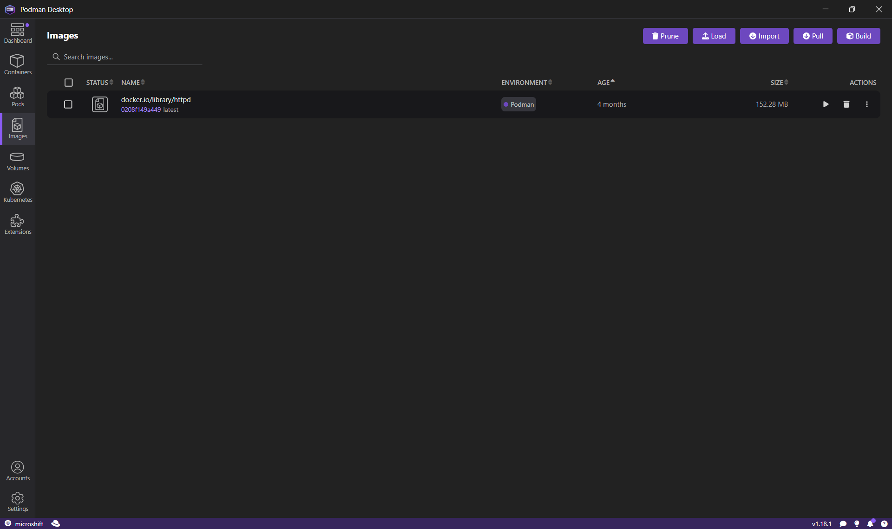
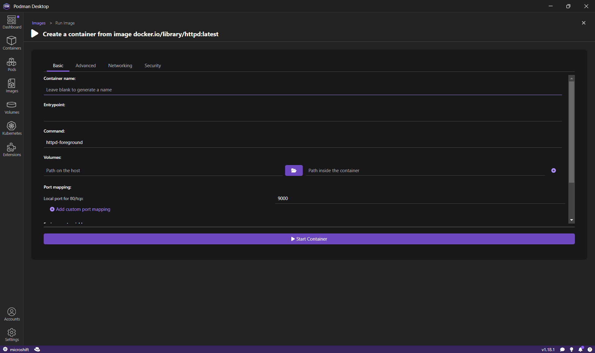

Red Hat provides a tool called Image Builder that allows developers to build their own custom image of RHEL in a variety of formats. Recently, Image Builder added WSL as a target, enabling you to run RHEL on Windows as a WSL distribution.

This [article](https://developers.redhat.com/articles/2023/11/15/create-customized-rhel-images-wsl-environment) details the steps and actions required to build and run your RHEL 10 WSL image.

The purpose of this article is to describe the options needed for the RHEL 10 WSL distribution so that it can be used as a Podman machine.

# Requirements

To use the RHEL 10 WSL image as a Podman machine, ensure that the following packages are installed:

- podman
- podman-docker
- procps-ng
- openssh-server
- net-tools
- iproute
- sudo
- iptables-nft

Luckily, all are available from the pre-configured RHEL 10 repositories.

# Build the image

Navigate to [image builder](https://console.redhat.com/insights/image-builder)

Click **Create blueprint** to open the **Create image** dialog wizard.

On the **Image output** page, select the following:

- From the **Release** list, select Red Hat Enterprise Linux (RHEL) 10.
- From the **Select target environments** option, select **WSL - Windows Subsystem for Linux (**`.tar.gz`**)**.
- Click **Next**.

On the **Register** page, select **Automatically register and enable advanced capabilities.**

- From the dropdown menu, choose an activation key to use for the image. See [Creating an activation key](https://access.redhat.com/documentation/en-us/subscription_central/2023/html/getting_started_with_activation_keys_on_the_hybrid_cloud_console/assembly-creating-managing-activation-keys#proc-creating-act-keys-console_).
- Click **Next**.

On the **OpenSCAP** page, as it is not supported for WSL images, click **Next**.

On the **File system configuration** page, select **Recommended: Use automatic partitioning**.

- Click **Next**.

On the **Repeatable build** page, select **Disable repeatable build**.

- Click **Next**.

On the **Custom repositories** page.

- Click **Next**.

- On the **Additional packages** page:

  - On the **Available packages** search field, enter podman.
  - Select the podman and podman-docker packages.
  - On the **Available packages** search field, enter procps-ng.
  - Select the procps-ng package.
  - On the **Available packages** search field, enter openssh-server.
  - Select the openssh-server package.
  - On the **Available packages** search field, enter net-tools.
  - Select the net-tools package.
  - On the **Available packages** search field, enter iproute.
  - Select the iproute package.
  - On the **Available packages** search field, enter sudo.
  - Select the sudo package.
  - On the **Available packages** search field, enter iptables-nft.
  - Select the iptables-nft package.
  - Click **Next**

On the **Users** page:

- Click **Next**.

On the **Timezone** page:

- Click **Next**.

On the **Locale** page:

- Click **Next**.

On the **Hostname** page:

- Click **Next**.

On the **Kernel** page:

- Click **Next**.

On the **Firewall** page:

- Click **Next**.

On the **Systemd services** page:

- Click **Next**.

- On the **First boot script configuration** page:

- Click **Next**.

On the **Details** page:

- In the **Blueprint name**, enter rhel10-wsl.
- Click **Next**.

On the **Review** page:

- Click **Create blueprint and build image** (available .

The image is being built. Once the build is finished, the download link will be available. Click on the **Download (.tar.gz)** link and save the downloaded file to one of your local folders.

# Create the RHEL 10 WSL podman machine

Launch Podman Desktop and go to the **Settings -> Resources** page:

On the Podman provider, click on **Create new ...**

On the **Create Podman machine** page, click the **Browse** button for the **Image Path** field and select the file downloaded from Image Builder.

Click on the **Create** button: the machine will be created and started. After a short time, the operation status should be reported.

# Let's play with the RHEL WSL podman machine

Go to the **Images** page and pull the **httpd** image

Click on **Done**

Start the image by clicking on the **Run image** icon

Once the container is started, the Apache server can be accessed on [localhost:9000](http://localhost:9000)
