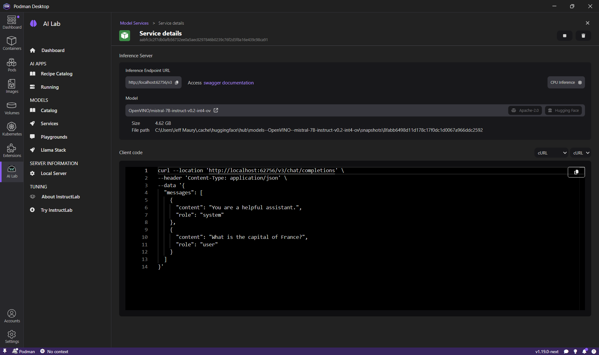
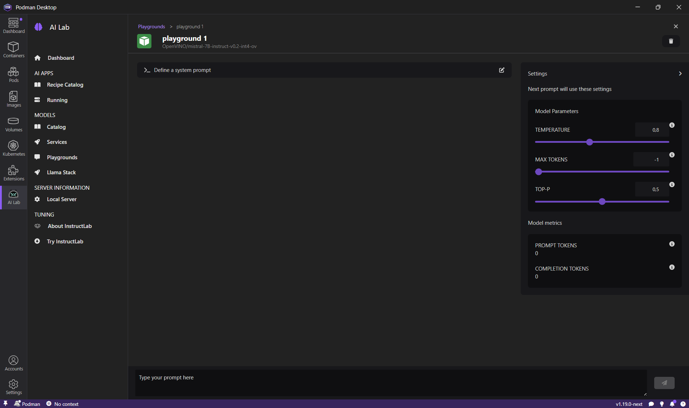
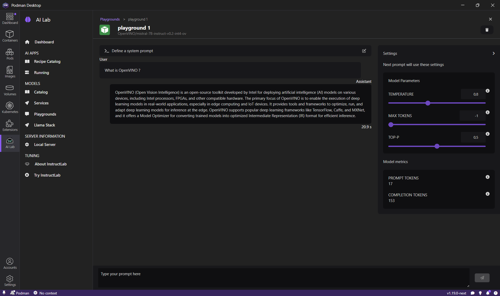

# Enabling OpenVino Inference in Podman AI Lab

## Introduction to Podman AI Lab

Podman AI Lab is an open-source platform designed to simplify the deployment, management, and experimentation of AI workloads using container technology. It provides a user-friendly interface for running, testing, and scaling AI models locally or in the cloud, leveraging the power and flexibility of Podman containers.

## What is OpenVino?

OpenVino™ (Open Visual Inference and Neural Network Optimization) is an open-source toolkit developed by Intel to accelerate AI inference on a variety of hardware, including CPUs, GPUs, and specialized accelerators. It optimizes deep learning models for fast, efficient inference, making it a popular choice for edge and cloud AI applications.

## Using OpenVino in Podman AI Lab

Podman AI Lab now supports OpenVino as an inference provider. This means you can:

- Select an OpenVino compatible model when starting an inference server or playground.
- Benefit from hardware-accelerated inference on supported Intel devices.
- Easily switch between different inference providers (e.g., llama-cpp, OpenVino) for benchmarking and compatibility testing.

**How to use:**

1. Launch Podman AI Lab and navigate to the model deployment or playground section.
2. When configuring your model, choose an OpenVino compatible model.
3. Start the inference server or playground and observe accelerated inference performance, especially on Intel hardware.

## Starting an OpenVINO inference server

1. Click the Podman AI Lab icon in the navigation bar
2. In the Podman AI Lab navigation bar, click _Models > Services_ menu item.
3. Click the _New Model Service_ button on the top right.
4. Select an OpenVINO compatible model in the list (eg OpenVINO/mistral-7B-instruct-v0.2-int4-ov) in the _Model_ list and click the _Create Service_ button.
5. The inference server for the model is being started and after a while, click on the _Open service_ details button.

Using the terminal shell, execute the given curl command and see the inference result output.

## Starting a playground with an OpenVINO compatible model

1. Click the Podman AI Lab icon in the navigation bar
2. In the Podman AI Lab navigation bar, click _Models > Playgrounds_ menu item.
3. Click the _New Playground_ button on the top right.
4. Select an OpenVINO compatible model in the list (eg OpenVINO/mistral-7B-instruct-v0.2-int4-ov) in the _Model_ list and click the _Create playground_ button.
5. The playground for the model is being started and after a while, a chat interface is displayed

Enter 'What is OpenVINO ?' in the prompt and click the _Send_ button. The OpenVINO model will respond with an answer.

## Consistency with OpenShift AI + OpenVino

One of the key advantages of using OpenVino in Podman AI Lab is the consistency it brings when transitioning workloads to OpenShift AI. Both platforms now support OpenVino, ensuring that:

- Models tested and optimized locally in Podman AI Lab will behave the same way when deployed to OpenShift AI.
- You can maintain a unified workflow from development to production, reducing surprises and integration issues.
- Performance optimizations and hardware acceleration are preserved across environments.

## Conclusion

By enabling OpenVino as an inference provider, Podman AI Lab empowers users to leverage high-performance AI inference both locally and in the cloud, with a consistent experience across platforms like OpenShift AI. This integration streamlines the AI development lifecycle and unlocks new possibilities for deploying efficient, scalable AI solutions.
