In the world of modern software development, containers and Kubernetes are no longer optional; they are essential. That’s where Podman Desktop comes in, your ultimate tool for building, managing, and deploying containers and Kubernetes clusters with ease and confidence. In this blogpost we will walk through a typical development workflow, creating and building a container and then testing it in a local Kubernetes cluster. Let’s dive in.

## Building Containerized Applications with Podman Desktop

First, let's start by building an application in a container with Podman Desktop. We need our application code and a Containerfile. For a simple application, your Containerfile might look something like:

```Dockerfile
FROM docker.io/nginxinc/nginx-unprivileged

COPY <<EOF /usr/share/nginx/html/index.html
<!DOCTYPE html>
<html>
<head>
    <title>Simple NGINX Container</title>
</head>
<body>
    <h1>Hello from my Podman NGINX Container!</h1>
    <p>This content is being served by NGINX running in a Podman container.</p>
</body>
</html>
EOF
```

To enhance security, we utilize the `nginx-unprivileged` image. This helps avoid root access, which is enforced by default in some Kubernetes distributions like OpenShift. The default NGINX image uses port 80, which is forbidden in rootless mode.

Once your application and Containerfile are ready, Podman Desktop makes the build process straightforward:
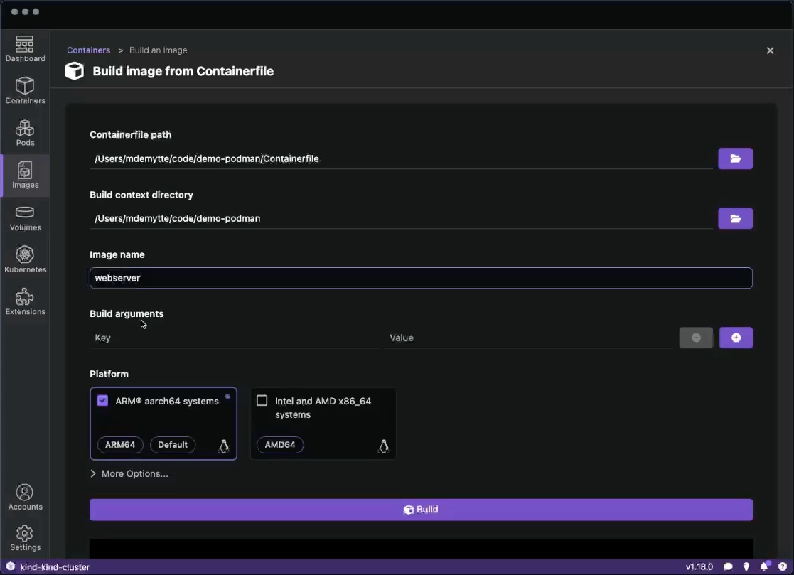

1. Navigate to the "Images" section
2. Select your Containerfile
3. Provide a name for your image (e.g. webserver)
4. Click "Build"

After building your image, you can immediately run it with a single click, and your container will appear in the "Containers" list.

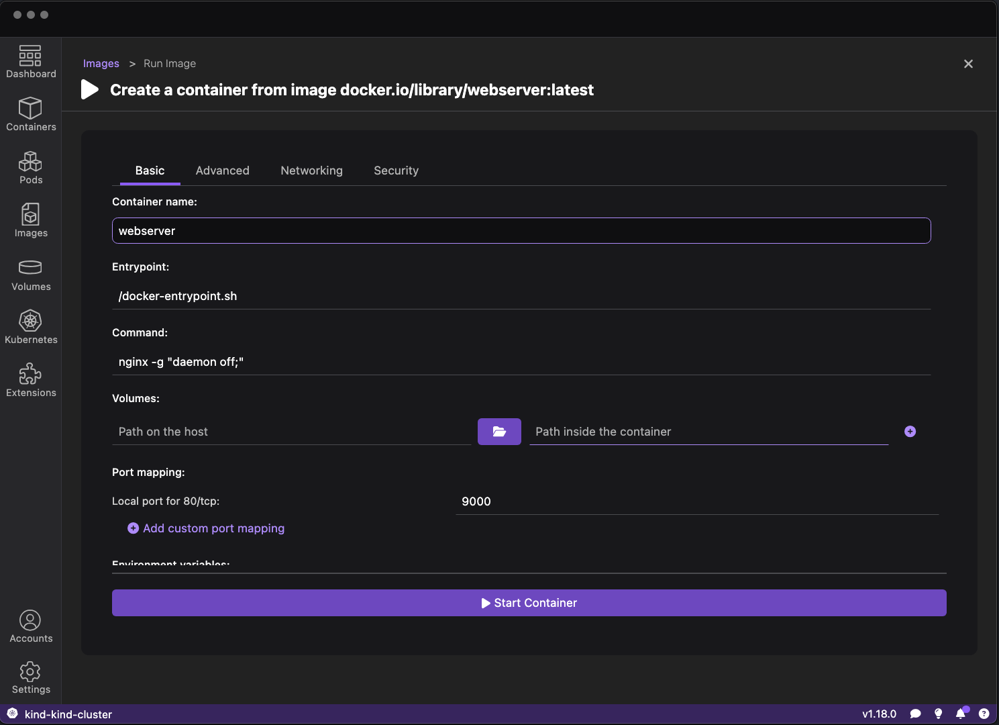

1. Find your container on the “Images” list
2. Click the “Run Image ▶️” button
3. Give your container a name we will call it: “webserver”

### Container Management and Log Analysis

Now that our webserver container is running we can inspect it in the UI
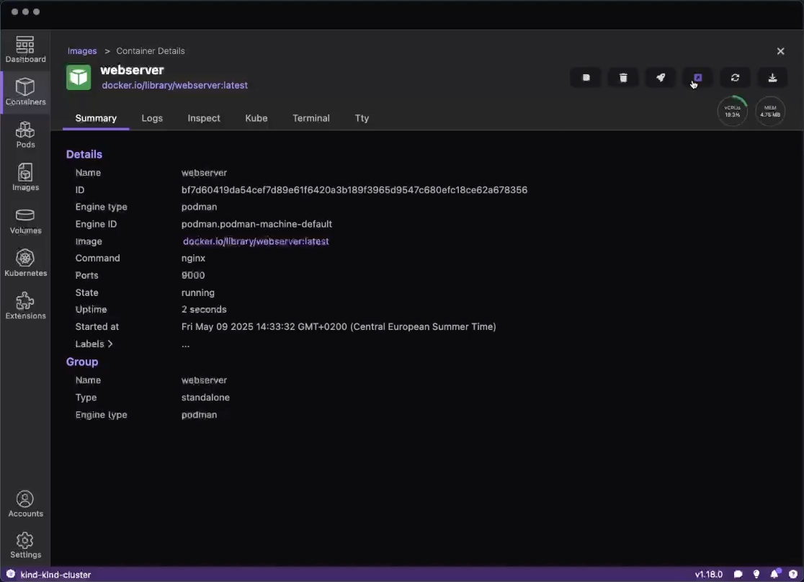

We can click the Open Browser button to see the webserver in our browser:
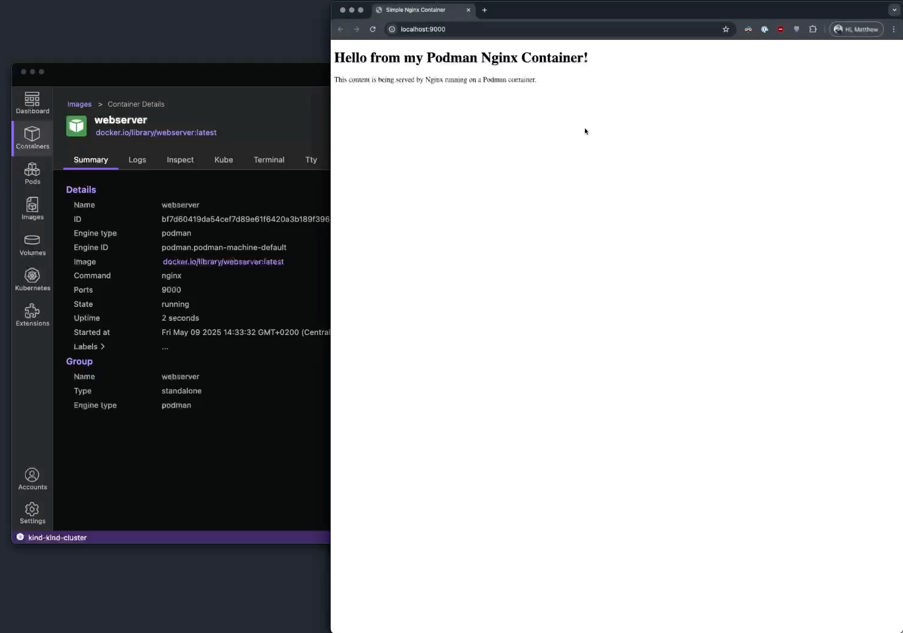

Monitoring container logs is crucial for debugging and understanding application behavior. Let's use Podman Desktop to view the logs of the newly created container.

1. Select your running container from the "Containers" list
2. Click on the "Logs" tab to view the container's logs
3. In the newest version of Podman Desktop you can also search in the logs\!

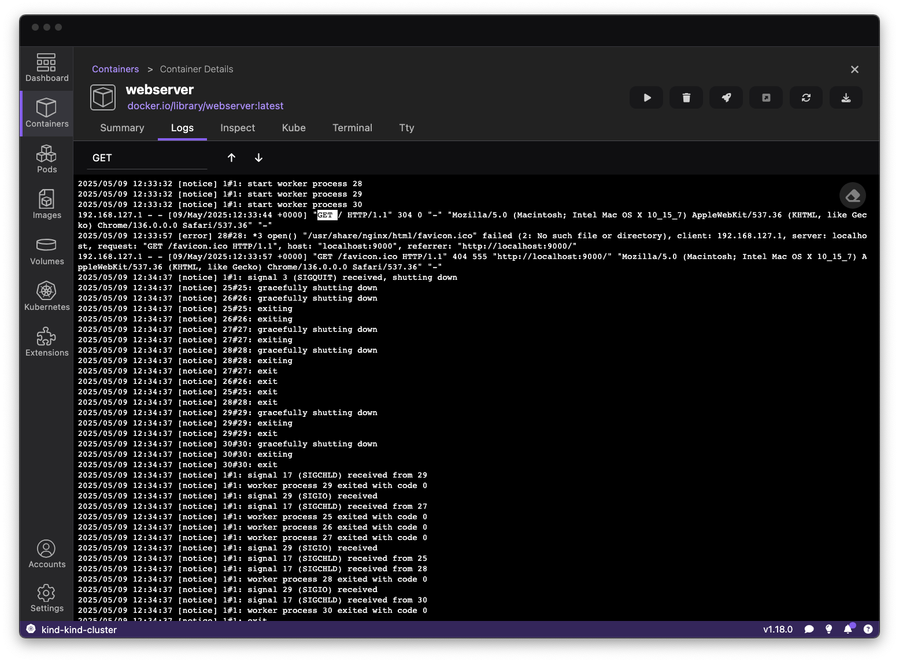

With that, we can continue the development process. We are able to rebuild our container when we have updated code. On top of that, we can share our Containerfile with our team who will be able to reproduce the exact same environment as us to build and test their code.

## Working with Kubernetes and OpenShift

Now that we have a development setup up and running, it’s time to get ready for production. In today's world, it is natural for us to move to Kubernetes. Having a locally running cluster, we are able to iterate quickly but still have an environment that is as close to production as possible. This aids in a smoother migration in the future. Podman Desktop is here to help you test and execute that migration.

With [kind](https://kind.sigs.k8s.io/) or [minikube](https://minikube.sigs.k8s.io/docs/), we are able to have a locally running Kubernetes cluster in minutes. This will allow us to test our application in a Kubernetes environment. Kind comes installed together with Podman Desktop so you will be able to get started instantly.

1. Start by navigating to the “Kubernetes” page
2. Click on the “Create new Kind cluster” button

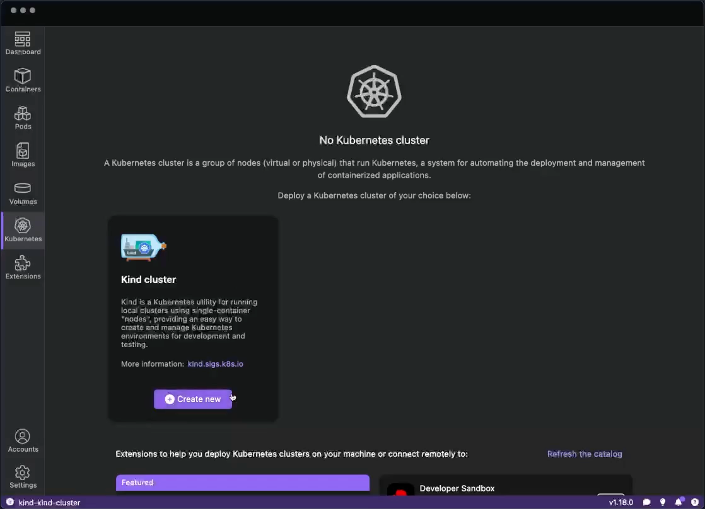

3. Click “Create”
4. Wait until the kind cluster gets created
5. Once the cluster is created, Podman Desktop will automatically switch your Kubernetes context to the new kind cluster. If you want to change your cluster, you can switch contexts in the statusbar.

We now have a locally running Kubernetes cluster which we can explore on the Kubernetes dashboard.

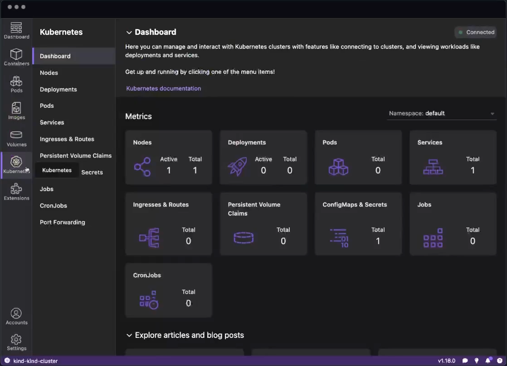

This dashboard not only gives you an overview of your cluster but it also provides quick access to the different Kubernetes objects that exist in the cluster.

### Creating the Pod on your local Kubernetes cluster

With a running Kubernetes cluster, we can now create our pod in the Kubernetes cluster. Using Podman Desktop, we can convert our previously created container into a Pod in our kind cluster.

First we have to push our image to our kind cluster.
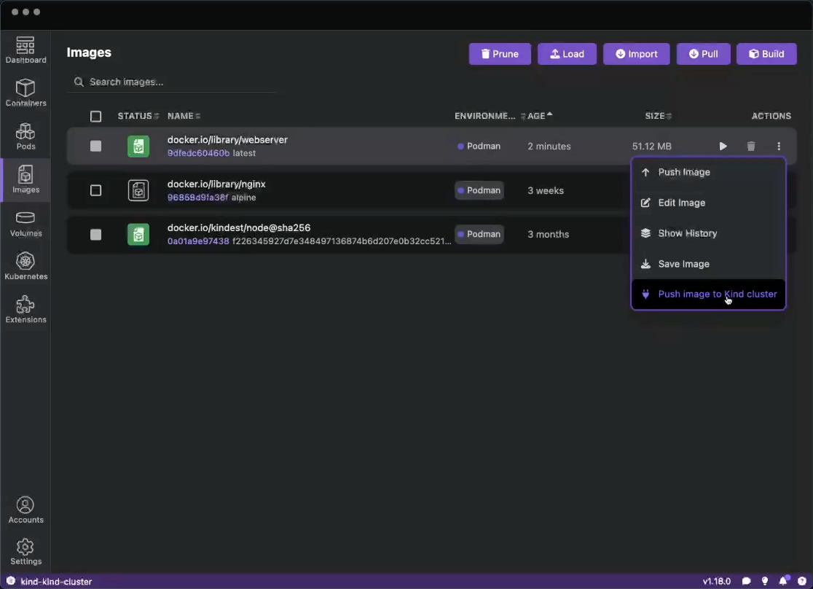

Now that the image is available we can use the Podman Desktop UI to Deploy our container to a Pod
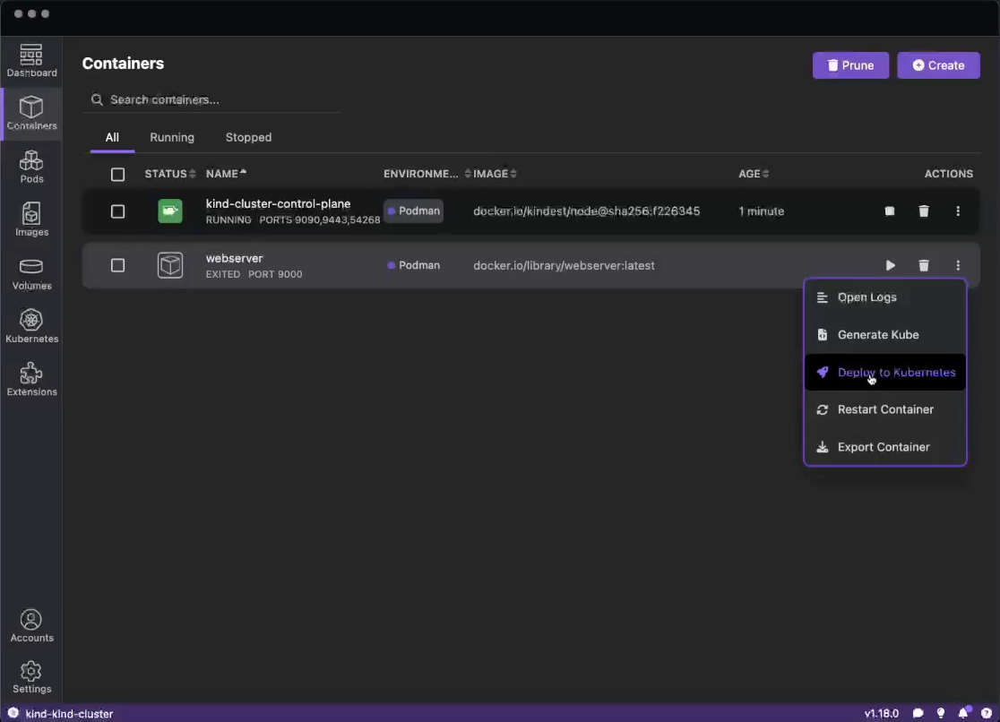

1. Navigate to the “Containers” section
2. On the webserver container, click the “Deploy to Kubernetes” button
3. Choose your kind cluster

The conversion from containers to Kubernetes manifests is particularly valuable, eliminating the need to manually write YAML files for simple deployments.

## Monitoring Kubernetes Events and Resources

Understanding what's happening in your Kubernetes cluster is essential for effective development. In the latest version of Podman Desktop, you can now check the events of your Kubernetes Pods in the UI.

Let's check if our pod was created and running successfully.

1. Navigate to the “Kubernetes” in the left-navigation
2. Click on the “Pods” sub-navigation
3. Click on the pods you just created
4. Scroll to the bottom and check the “Events”
5. We can see that our Pod was started and is running

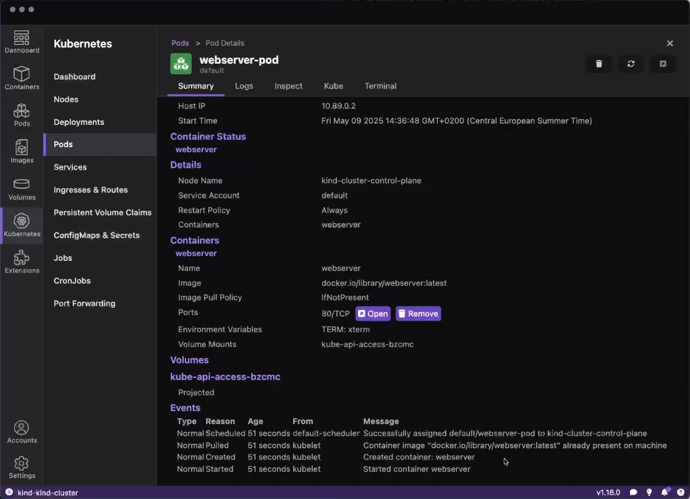

We can also check out the “Logs” tab to see the logs of the running Pod.
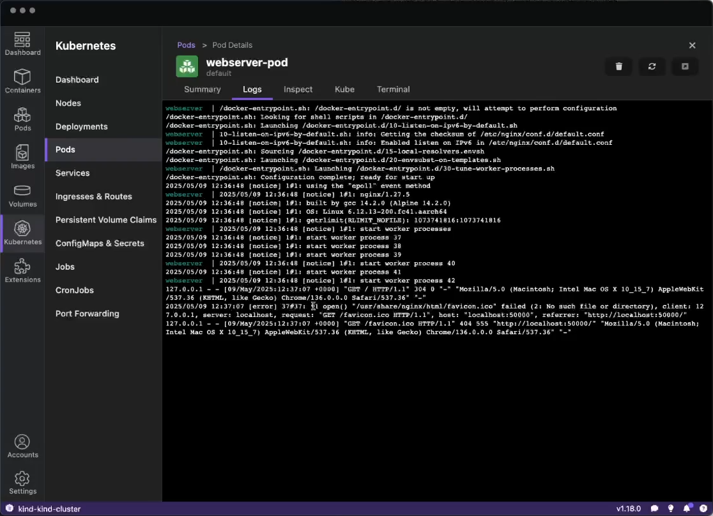

### Video walkthrough

<iframe
  width="560"
  height="315"
  src="https://www.youtube.com/embed/orEZhYDf6sA"
  title="Containers and Kubernetes development with Podman Desktop"
  frameBorder="0"
  allow="accelerometer; autoplay; clipboard-write; encrypted-media; gyroscope; picture-in-picture"
  allowFullScreen
></iframe>

## Conclusion

Podman Desktop significantly streamlines the container and Kubernetes development experience by providing:

- A unified interface for building and managing containers
- Seamless integration with Kubernetes and OpenShift
- Powerful logging and debugging tools
- A bridge between local development and production Kubernetes environments

Whether you're just starting with containers or managing complex Kubernetes deployments, Podman Desktop offers tools that simplify your workflow and increase productivity. As [a CNCF project](https://podman-desktop.io/blog/2024/11/14/podman-desktop-cncf), it continues to evolve with the needs of the cloud-native community, making it an increasingly valuable tool in any developer's toolkit.

Try Podman Desktop today and experience how it can transform your container, Kubernetes and OpenShift workflows\!
