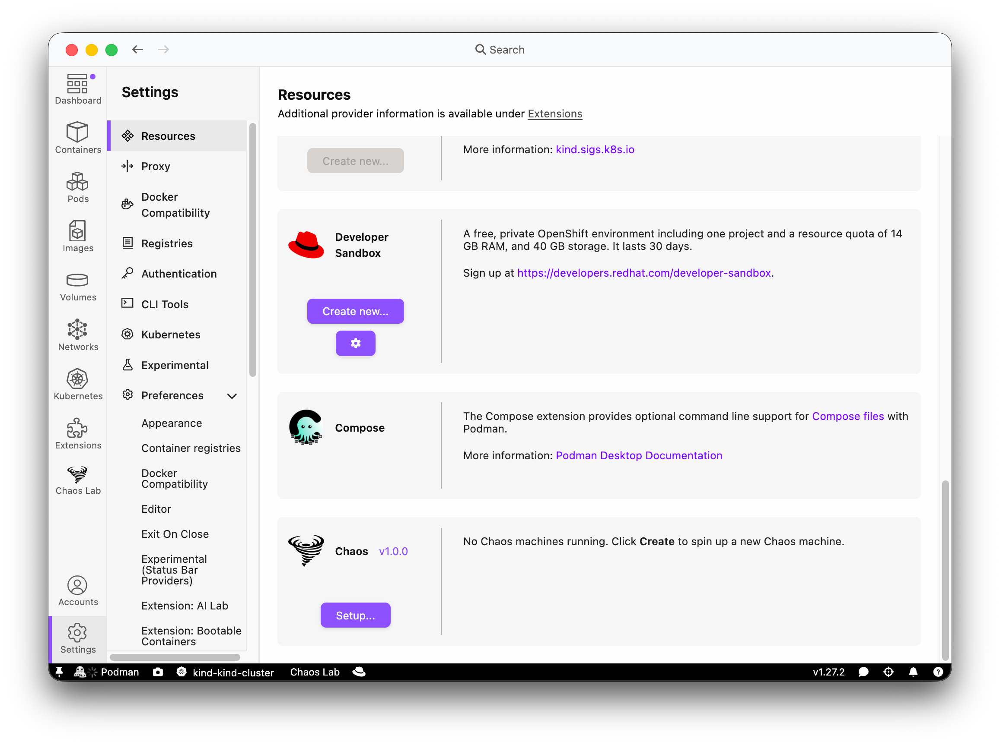
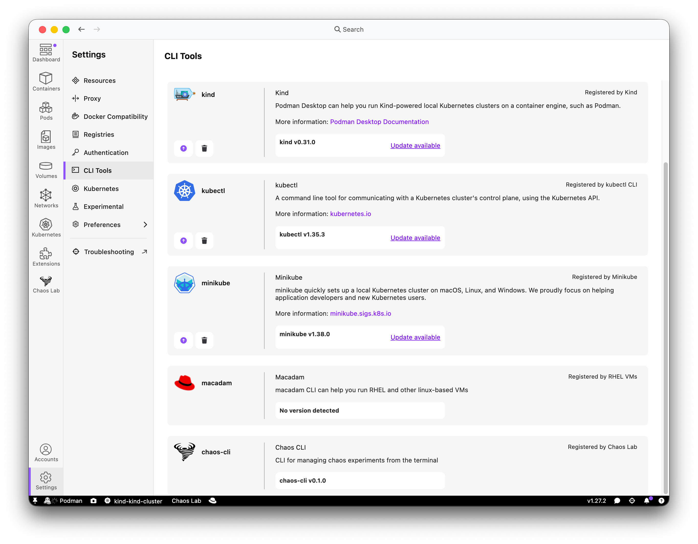
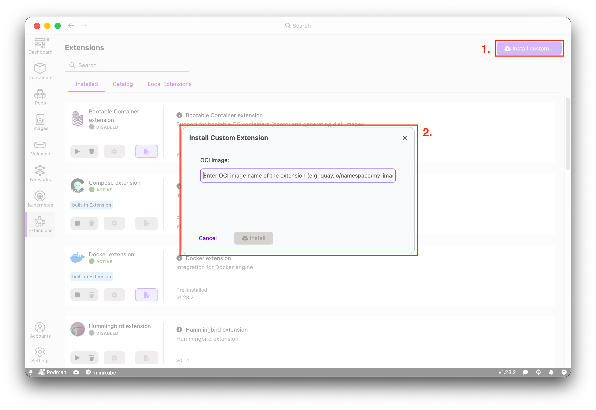

Extensions let you add custom features to Podman Desktop -- new commands, status bar indicators, tray menus, webview dashboards, configuration panels, providers, onboarding workflows, and more. In this post we walk through building a real extension from scratch, covering the most important APIs along the way.

The content is based on the [DevConf.CZ 2026 workshop](https://pretalx.devconf.info/devconf-cz-2026/talk/WQULVZ/) _"Podman Desktop -- Creating extensions to simplify container workflows"_. The companion repository provides 14 progressive branches, each introducing one API concept with a TODO placeholder you fill in yourself.

<!--truncate-->

---

## Prerequisites

- **Podman Desktop** 1.17 or later ([download](https://podman-desktop.io/downloads))
- **Node.js** 24+ and **npm** 11+
- A running **Podman** machine (macOS / Windows) or Podman installed natively (Linux)
- A container to experiment with -- `podman run -d fedora sleep infinity` is enough

> **_NOTE:_** this workshop is built on top of a POC extension, so keep in mind that some of the features might not work as expected or might not work at all. Target this extension at containers that can tolerate some pressure -- don't point it at anything you care about.

## Podman Desktop Extension features

These guides cover the most frequently used APIs when building an extension:

- [Commands](/docs/extensions/developing/commands) -- register actions users can invoke from the command palette and menus
- [Configuration](/docs/extensions/developing/config) -- declare settings in `package.json` and read them at runtime
- [Menus](/docs/extensions/developing/menu) -- add items to context menus
- [Status bar](/docs/extensions/developing/status-bar) -- add clickable indicators to the bottom bar
- [Progress tasks](/docs/extensions/developing/progress-tasks) -- show progress in the task widget during long operations
- [Tray menu](/docs/extensions/developing/tray-menu) -- add items to the system tray icon menu
- [CLI tools](/docs/extensions/developing/cli-tools) -- register CLI tools in the Settings page
- [Onboarding workflow](/docs/extensions/developing/onboarding-workflow) -- guide users through first-time setup
- [Webview messaging](/docs/extensions/developing/webview-messaging) -- communicate between the extension and its webview panel
- [Adding UI components](/docs/extensions/developing/adding-ui-components) -- use the `@podman-desktop/ui-svelte` library in webviews
- [Adding icons](/docs/extensions/developing/adding-icons) -- customize your extension's icons

If you want to learn more about the internals of the extension check [Developing a Podman Desktop extension](https://podman-desktop.io/docs/extensions/developing).

## Project setup

Clone the workshop repository and check out the first branch:

```bash
git clone https://github.com/gastoner/extension-template-full
cd extension-template-full
git checkout workshop/01-progress-task
npm install && npm run build
```

The repository is a monorepo with three packages:

| Package             | Role                                                                              |
| ------------------- | --------------------------------------------------------------------------------- |
| `packages/backend`  | Extension entry point (`activate` / `deactivate`), Podman API calls, chaos engine |
| `packages/frontend` | Svelte 5 + Tailwind CSS dashboard with `@podman-desktop/ui-svelte`                |
| `packages/shared`   | RPC types and message proxy connecting frontend and backend                       |

The extension can use [`@podman-desktop/ui-svelte`](https://www.npmjs.com/package/@podman-desktop/ui-svelte?activeTab=code) UI package with basic UI components to help you build your extension. For building the feature set of your extension you can use [`@podman-desktop/api`](https://www.npmjs.com/package/@podman-desktop/api?activeTab=code) to do so.

### Loading the extension in Podman Desktop for development

1. Open **Settings > Preferences** and enable **Development Mode**.
   1. For some of the steps enabling **Status Bar** and **Toast** in **Tasks** category is required.
2. Navigate to **Extensions > Local Extensions**.
3. Click **Add a local folder...** and select the `packages/backend` folder.
4. The extension appears in the **Installed** tab and a **Chaos Lab** entry shows up in the navigation bar.

<video autoPlay loop muted playsInline width="100%">
  <source src={require('./img/writing-custom-extensions/workshopPrep.webm').default} type="video/webm" />
</video>

> **_NOTE:_** After each rebuild (`npm run build`) you need to disable and re-enable the extension. You can use `npm run watch` in the extension to automatically build it, together with `pnpm watch --extension-folder` in cloned Podman Desktop for automatic reloading of the extension.

### How the workshop branches work

Each branch (`workshop/01-progress-task` through `workshop/14-cli-tool`) contains a numbered TODO comment in the source code. Your task is to replace the placeholder with real code. The next branch always contains the solution for the previous step, and the `dev_conf` branch has everything completed.

```
workshop/01-progress-task   →  TODO #1  (withProgress)
workshop/02-status-bar      →  TODO #2  (createStatusBarItem)
workshop/03-status-bar-dynamic → TODO #3 (dynamic status bar)
...
workshop/14-cli-tool        →  TODO #14 (createCliTool)
dev_conf                    →  all TODOs completed
```

## Before each step you should have some kind of container 'attack' running, e.g. resource limiting.

## Step 1 -- Progress tasks

**Branch:** `workshop/01-progress-task` | **File:** `chaos-api-impl.ts` | **Docs:** [Progress tasks](/docs/extensions/developing/progress-tasks)

The `withProgress` API shows a task in the Podman Desktop task widget with a title, message, and progress bar.

The TODO placeholder wraps a bare call to `this.engine.stopAll()`:

```typescript
async stopAllChaos(): Promise<void> {
  // TODO #1: Wrap with extensionApi.window.withProgress()
  await this.engine.stopAll();
}
```

Replace it with a progress-reporting version:

```typescript
async stopAllChaos(): Promise<void> {
  await extensionApi.window.withProgress(
    { location: extensionApi.ProgressLocation.TASK_WIDGET, title: 'Stop All Chaos' },
    async progress => {
      progress.report({ increment: 0, message: 'Stopping all chaos operations...' });
      await this.engine.stopAll();
      progress.report({ increment: 100, message: 'All chaos operations stopped' });
    },
  );
}
```

`progress.report()` accepts `message` (text shown under the title) and `increment` (0--100 progress bar value).

<video autoPlay loop muted playsInline width="100%">
  <source src={require('./img/writing-custom-extensions/workshop1.webm').default} type="video/webm" />
</video>

---

## Steps 2--3 -- Status bar

**Branch:** `workshop/02-status-bar`, `workshop/03-status-bar-dynamic` | **File:** `extension.ts` | **Docs:** [Status bar](/docs/extensions/developing/status-bar)

### Creating a static status bar item

`createStatusBarItem()` adds a clickable item to the bottom bar. Set its `.text`, `.command`, and call `.show()`:

```typescript
const chaosStatusBar = extensionApi.window.createStatusBarItem();
chaosStatusBar.text = 'Chaos Lab';
chaosStatusBar.command = 'chaos-lab.openChaos';
if (settings.showStatusBarChaos) {
  chaosStatusBar.show();
}
extensionContext.subscriptions.push(chaosStatusBar);
```

### Dynamically updating the text

Use `setInterval` to poll `chaosEngine.getState()` and reflect the number of active attacks:

```typescript
statusBarUpdateInterval = setInterval(() => {
  const state = chaosEngine?.getState();
  if (state && state.runningAttacks > 0) {
    chaosStatusBar.text = `Chaos Lab (${state.runningAttacks} active)`;
  } else {
    chaosStatusBar.text = 'Chaos Lab';
  }
}, 3000);
extensionContext.subscriptions.push({
  dispose: () => {
    if (statusBarUpdateInterval) {
      clearInterval(statusBarUpdateInterval);
      statusBarUpdateInterval = undefined;
    }
  },
});
```

Always push disposables to `extensionContext.subscriptions` so they are cleaned up when the extension deactivates.

Static status bar item:

<video autoPlay loop muted playsInline width="100%">
  <source src={require('./img/writing-custom-extensions/workshop2.webm').default} type="video/webm" />
</video>

Dynamic updates reflecting active attacks:

<video autoPlay loop muted playsInline width="100%">
  <source src={require('./img/writing-custom-extensions/workshop3.webm').default} type="video/webm" />
</video>

---

## Steps 4--5 -- Commands

**Branch:** `workshop/04-command-stop-all`, `workshop/05-command-open-dashboard` | **File:** `extension.ts` | **Docs:** [Commands](/docs/extensions/developing/commands)

Commands are registered with `extensionApi.commands.registerCommand(id, callback)`. The `id` must match entries in `package.json` under `contributes.commands`.

### "Stop All Chaos" command

```typescript
const stopAllCommand = extensionApi.commands.registerCommand('chaos-lab.stopAll', async () => {
  await chaosApiImpl.stopAllChaos();
  extensionApi.window.showInformationMessage('All chaos operations have been stopped and rolled back.');
});
extensionContext.subscriptions.push(stopAllCommand);
```

`showInformationMessage` displays a toast notification in the UI.

### "Open Dashboard" command

```typescript
const openChaosCommand = extensionApi.commands.registerCommand('chaos-lab.openChaos', () => {
  panel.reveal();
});
extensionContext.subscriptions.push(openChaosCommand);
```

Make sure to also declare the command in `package.json`:

```json
{
  "contributes": {
    "commands": [{ "command": "chaos-lab.openChaos", "title": "Chaos Lab: Open Dashboard" }]
  }
}
```

"Stop All Chaos" command with toast notification:

<video autoPlay loop muted playsInline width="100%">
  <source src={require('./img/writing-custom-extensions/workshop4.webm').default} type="video/webm" />
</video>

"Open Dashboard" command revealing the webview panel:

<video autoPlay loop muted playsInline width="100%">
  <source src={require('./img/writing-custom-extensions/workshop5.webm').default} type="video/webm" />
</video>

---

## Step 6 -- Webview messaging

**Branch:** `workshop/06-command-view-container` | **File:** `extension.ts` | **Docs:** [Webview messaging](/docs/extensions/developing/webview-messaging)

Extensions communicate with their webview via `postMessage`. This command receives a container object from a context menu, opens the dashboard, and tells the frontend to navigate to that container's detail page:

```typescript
const viewContainerCommand = extensionApi.commands.registerCommand(
  'chaos-lab.viewContainerUsage',
  async (container: { id?: string; Id?: string }) => {
    const containerId = container?.id ?? container?.Id;
    panel.reveal();
    await new Promise(resolve => setTimeout(resolve, 200));
    await panel.webview.postMessage({
      type: 'navigate',
      url: `/chaos/container/${containerId}`,
    });
  },
);
extensionContext.subscriptions.push(viewContainerCommand);
```

The short delay gives the webview time to become visible before receiving the message. On the frontend side, a message listener in Svelte picks up `{ type: 'navigate' }` and routes accordingly.

The context menu entry is declared in `package.json`:

```json
{
  "contributes": {
    "menus": {
      "dashboard/container": [{ "command": "chaos-lab.viewContainerUsage", "title": "View Container (Chaos Lab)" }]
    }
  }
}
```

<video autoPlay loop muted playsInline width="100%">
  <source src={require('./img/writing-custom-extensions/workshop6.webm').default} type="video/webm" />
</video>

---

## Step 7 -- Tray menu

**Branch:** `workshop/07-tray-menu` | **File:** `extension.ts` | **Docs:** [Tray menu](/docs/extensions/developing/tray-menu)

Register a submenu in the system tray that groups related commands:

```typescript
const trayItem = extensionApi.tray.registerMenuItem({
  id: 'chaos-lab.tray',
  type: 'submenu',
  label: 'Chaos Lab',
  submenu: [
    { id: 'chaos-lab.openChaos', label: 'Open Dashboard', type: 'normal' },
    { id: 'chaos-lab.stopAll', label: 'Stop All Chaos', type: 'normal' },
  ],
});
extensionContext.subscriptions.push(trayItem);
```

Each submenu item's `id` must match a registered command. When the user clicks a tray entry, Podman Desktop invokes the corresponding command.

<video autoPlay loop muted playsInline width="100%">
  <source src={require('./img/writing-custom-extensions/workshop7.webm').default} type="video/webm" />
</video>

---

## Steps 8--9 -- Configuration

**Branch:** `workshop/08-config-change-listener`, `workshop/09-config-read-values` | **File:** `settings-manager.ts` | **Docs:** [Configuration](/docs/extensions/developing/config)

Configuration properties are declared in `package.json` under `contributes.configuration`. The extension reads them at startup and reacts to changes.

### Declaring configuration in package.json

```json
{
  "contributes": {
    "configuration": {
      "title": "Chaos Lab",
      "properties": {
        "chaos-lab.chaosSafeContainers": {
          "type": "string",
          "default": "",
          "description": "Comma-separated container name patterns protected from chaos (supports * wildcards)."
        },
        "chaos-lab.showStatusBarChaos": {
          "type": "boolean",
          "default": true,
          "description": "Show the Chaos mode indicator in the status bar."
        }
      }
    }
  }
}
```

### Listening for changes

```typescript
load(): void {
  this.readConfig();

  this.disposable = extensionApi.configuration.onDidChangeConfiguration(e => {
    if (e.affectsConfiguration(CONFIG_SECTION)) {
      this.readConfig();
      for (const listener of this.changeListeners) {
        listener(this.current);
      }
    }
  });
}
```

### Reading configuration values

```typescript
private readConfig(): void {
  const config = extensionApi.configuration.getConfiguration(CONFIG_SECTION);

  this.current = {
    chaosSafeContainers: this.parseSafeContainers(
      config.get<string>('chaosSafeContainers') ?? '',
    ),
    showStatusBarChaos:
      config.get<boolean>('showStatusBarChaos') ?? DEFAULT_SETTINGS.showStatusBarChaos,
  };
}
```

`getConfiguration(section)` returns a config reader scoped to your extension. Use `config.get<T>(key)` with a fallback to handle missing values.

<video autoPlay loop muted playsInline width="100%">
  <source src={require('./img/writing-custom-extensions/workshop9.webm').default} type="video/webm" />
</video>

---

## Steps 10--11 -- Provider and connection factory

**Branch:** `workshop/10-create-provider`, `workshop/11-connection-factory` | **File:** `chaos-provider.ts`

Providers appear in the Podman Desktop **Resources** page and can manage connections (machines, engines).

### Creating the provider

```typescript
providerInstance = extensionApi.provider.createProvider({
  id: 'chaos',
  name: 'Chaos',
  status: 'installed',
  version: '1.0.0',
  images: {
    icon: './icon.png',
    logo: { dark: './icon.png', light: './icon.png' },
  },
  emptyConnectionMarkdownDescription: 'No Chaos machines running. Click **Create** to spin up a new Chaos machine.',
});
extensionContext.subscriptions.push(providerInstance);
```

### Setting up the connection factory

The connection factory lets users create new "machines" from the Resources page:

```typescript
providerInstance.setContainerProviderConnectionFactory({
  creationDisplayName: 'Chaos Machine',
  creationButtonTitle: 'Create Chaos Machine',

  create: async (params, logger, _token) => {
    const machineName = (params['chaos.factory.machine.name'] as string) || `chaos-${Date.now()}`;
    const cpus = Number(params['chaos.factory.machine.cpus']) || DEFAULT_CONFIG.cpus;
    const memoryBytes = Number(params['chaos.factory.machine.memory']) || DEFAULT_CONFIG.memoryMb * 1024 * 1024;
    const diskBytes = Number(params['chaos.factory.machine.diskSize']) || DEFAULT_CONFIG.diskGb * 1024 * 1024 * 1024;

    const memoryMb = Math.round(memoryBytes / (1024 * 1024));
    const diskGb = Math.round(diskBytes / (1024 * 1024 * 1024));
    const config: MachineConfig = { cpus, memoryMb, diskGb };

    logger?.log(`Creating Chaos machine '${machineName}'...`);
    registerMachineConnection(machineName, config);
    providerInstance?.updateStatus('ready');
    logger?.log(`Chaos machine '${machineName}' created and running`);
  },
});
```

The `params` object contains values from configuration properties scoped to `ContainerProviderConnectionFactory`. The factory parameters (name, CPUs, memory, disk) are declared in the same `contributes.configuration` section of `package.json` with `"scope": "ContainerProviderConnectionFactory"`.

The Chaos provider on the Resources page:



Creating a Chaos Machine via the connection factory:

<video autoPlay loop muted playsInline width="100%">
  <source src={require('./img/writing-custom-extensions/workshop11.webm').default} type="video/webm" />
</video>

---

## Step 12 -- CI/CD workflows

**Branch:** `workshop/12-ci-workflows` | **Files:** `.github/workflows/`

### Packaging as an OCI image

The `Containerfile` uses a multistage build: the first stage installs and builds, the second copies only the built artifacts into a `scratch` image:

```dockerfile
FROM node:24-slim AS builder
COPY . /app
WORKDIR /app
RUN npm install --frozen-lockfile
RUN npm run build

FROM scratch
COPY --from=builder /app/packages/backend/dist/ /extension/dist
COPY --from=builder /app/packages/backend/package.json /extension/
COPY --from=builder /app/packages/backend/media/ /extension/media
COPY --from=builder /app/LICENSE /extension/
COPY --from=builder /app/packages/backend/icon.png /extension/
COPY --from=builder /app/README.md /extension/

LABEL org.opencontainers.image.title="Podman Desktop Chaos Lab Extension" \
  org.opencontainers.image.description="Containers durability harness tool" \
  io.podman-desktop.api.version=">= 1.22.0"
```

The `io.podman-desktop.api.version` label tells Podman Desktop which API version the extension requires.

### PR check workflow

A GitHub Actions workflow runs lint, format, typecheck, tests, and builds the extension image on every pull request:

```yaml
name: pr-check
on: [pull_request]

jobs:
  lint-format-unit:
    runs-on: ubuntu-24.04
    steps:
      - uses: actions/checkout@v6
      - uses: actions/setup-node@v6
        with:
          node-version: 24
          cache: 'npm'
      - run: npm install
      - run: npm run lint:check
      - run: npm run format:check
      - run: npm run test
      - run: npm run typecheck
      - run: npm run build

  build-container:
    runs-on: ubuntu-24.04
    steps:
      - uses: actions/checkout@v6
      - run: |
          podman build -t local_image ./
          CONTAINER_ID=$(podman create localhost/local_image --entrypoint "")
          mkdir -p output/plugins
          podman export $CONTAINER_ID | tar -x -C output/plugins/
          podman rm -f $CONTAINER_ID
```

### Nightly build

Push the extension image to `ghcr.io` on every merge to `main`, tagged with both `nightly` and the commit SHA:

```yaml
name: Build and Push
on:
  push:
    branches: ['main']

jobs:
  build:
    runs-on: ubuntu-24.04
    steps:
      - uses: actions/checkout@v6
      - run: echo "${{ secrets.GITHUB_TOKEN }}" | podman login --username ${{ github.repository_owner }} --password-stdin ghcr.io
      - run: |
          IMAGE_NAME=ghcr.io/${{ github.repository_owner }}/podman-desktop-extension-chaos-lab
          podman build -t ${IMAGE_NAME}:nightly .
          podman push ${IMAGE_NAME}:nightly
          podman tag ${IMAGE_NAME}:nightly ${IMAGE_NAME}:${GITHUB_SHA}
          podman push ${IMAGE_NAME}:${GITHUB_SHA}
```

---

## Step 13 -- Onboarding

**Branch:** `workshop/13-onboarding` | **File:** `chaos-provider.ts` + `package.json` | **Docs:** [Onboarding workflow](/docs/extensions/developing/onboarding-workflow)

Onboarding workflows guide first-time users through setup. The UI is declared in `package.json` and Podman Desktop renders it automatically -- your code just sets context values.

### Declarative onboarding in package.json

```json
{
  "contributes": {
    "onboarding": {
      "title": "Chaos Lab Setup",
      "enablement": "!onboardingContext:chaosProviderReady",
      "steps": [
        {
          "id": "checkProviderCommand",
          "label": "Check Provider",
          "title": "Checking for Chaos provider",
          "command": "chaos-lab.onboarding.checkProvider",
          "completionEvents": ["onCommand:chaos-lab.onboarding.checkProvider"]
        },
        {
          "id": "createMachineView",
          "label": "Create Machine",
          "title": "Create a Chaos Machine",
          "when": "!onboardingContext:chaosProviderReady",
          "component": "createContainerProviderConnection"
        },
        {
          "id": "setupSuccess",
          "title": "Chaos Lab is ready",
          "when": "onboardingContext:chaosProviderReady",
          "state": "completed",
          "content": [
            [
              {
                "value": "#### Chaos Lab is ready!\n:button[Open Dashboard]{command=chaos-lab.openChaos}",
                "highlight": true
              }
            ]
          ]
        }
      ]
    }
  }
}
```

### Setting context values from code

```typescript
const checkProviderDisposable = extensionApi.commands.registerCommand(
  'chaos-lab.onboarding.checkProvider',
  async () => {
    const ready = machines.size > 0;
    extensionApi.context.setValue('chaosProviderReady', ready, 'onboarding');
  },
);
extensionContext.subscriptions.push(checkProviderDisposable);
```

In the connection factory `create` callback, set the context on success or failure:

```typescript
try {
  registerMachineConnection(machineName, config);
  providerInstance?.updateStatus('ready');
  extensionApi.context.setValue('chaosProviderReady', true, 'onboarding');
} catch (err) {
  extensionApi.context.setValue('chaosMachineCreationFailed', true, 'onboarding');
  throw err;
}
```

The third argument `'onboarding'` scopes the value so the onboarding UI's `when` clauses can react to it.

<video autoPlay loop muted playsInline width="100%">
  <source src={require('./img/writing-custom-extensions/workshop13.webm').default} type="video/webm" />
</video>

---

## Step 14 -- CLI tool

**Branch:** `workshop/14-cli-tool` | **File:** `extension.ts` | **Docs:** [CLI tools](/docs/extensions/developing/cli-tools)

Register a CLI tool so it appears in the Podman Desktop CLI tools settings:

```typescript
const chaosCli = extensionApi.cli.createCliTool({
  name: 'chaos-cli',
  displayName: 'Chaos CLI',
  markdownDescription: 'CLI for managing chaos experiments from the terminal',
  images: { icon: './icon.png' },
  version: '0.1.0',
  path: '/usr/local/bin/chaos-cli',
});
extensionContext.subscriptions.push(chaosCli);
```

The chaos-cli registered in the CLI Tools settings:



---

## Packaging and distribution

### Building the OCI image locally

```bash
podman build -t chaos-lab .
```

### Installing from a local image

Extract the image filesystem into the Podman Desktop plugins directory:

```bash
pluginsFolder=~/.local/share/containers/podman-desktop/plugins/
mkdir -p $pluginsFolder

CONTAINER_ID=$(podman create localhost/chaos-lab --entrypoint "")
podman export $CONTAINER_ID | tar -x -C $pluginsFolder
mv $pluginsFolder/extension $pluginsFolder/chaoslab-extension

podman rm -f $CONTAINER_ID
podman rmi -f localhost/chaos-lab:latest
```

Restart Podman Desktop and the extension appears automatically.

### Installing a published image

Once an extension image is published to a registry, users can install it from **Extensions > Install Custom...** using the image reference -- no need to build anything locally. This applies even if you cloned the workshop repository to follow along: you don't have to build an image yourself unless you've made changes you want to keep. There are two ways to get a published image reference:

**Option A -- use the pre-built image from GitHub Container Registry**

Just following along without modifying the code? Since the [companion repository](https://github.com/gastoner/extension-template-full) lives on GitHub, its `Build and Push` workflow builds and publishes the extension image to `ghcr.io` on every push to `main` and `dev_conf`, tagged with both `nightly` and the commit SHA -- so you can install a working build without touching your local clone at all:

```
ghcr.io/gastoner/podman-desktop-extension-chaos-lab:dad9eaf759a4378f31f6e2d4527426101429e70e
```

Use the SHA tag above to install that exact commit, or `ghcr.io/gastoner/podman-desktop-extension-chaos-lab:nightly` for the latest build.

**Option B -- build and publish your own image**

Made your own changes to the cloned repository? Build and publish your version instead:

```bash
podman build -t quay.io/myusername/chaos-lab .
podman login quay.io
podman push quay.io/myusername/chaos-lab
```

Then use `quay.io/myusername/chaos-lab` as the image reference.



### Testing with a custom catalog

To test catalog integration locally, create an `extensions.json` file based on the [official catalog](https://github.com/podman-desktop/podman-desktop/blob/main/extensions.json), add your extension entry, serve it with a local HTTP server, and point Podman Desktop to it:

```bash
python -m http.server 8080
```

Add to your `settings.json`:

```json
{
  "extensions.registryUrl": "http://localhost:8080/extensions.json"
}
```

Open **Extensions > Catalog** and your extension appears alongside the official ones.

---

## Conclusion

In this walkthrough we covered the core Podman Desktop extension APIs:

| API                                      | What it does                              |
| ---------------------------------------- | ----------------------------------------- |
| `window.withProgress`                    | Show progress tasks in the task widget    |
| `window.createStatusBarItem`             | Add indicators to the status bar          |
| `commands.registerCommand`               | Register clickable actions                |
| `window.showInformationMessage`          | Display toast notifications               |
| `webview.postMessage`                    | Communicate with webview panels           |
| `tray.registerMenuItem`                  | Add items to the system tray              |
| `configuration.getConfiguration`         | Read user settings                        |
| `configuration.onDidChangeConfiguration` | React to setting changes                  |
| `provider.createProvider`                | Register a provider on the Resources page |
| `setContainerProviderConnectionFactory`  | Let users create connections              |
| `context.setValue`                       | Drive onboarding workflows                |
| `cli.createCliTool`                      | Register CLI tools                        |

The full workshop repository with all 14 progressive branches is available at [gastoner/extension-template-full](https://github.com/gastoner/extension-template-full). Check out the `dev_conf` branch for the completed solution.

For more details, see:

- [Extension API reference](https://www.npmjs.com/package/@podman-desktop/api)
- [Extension documentation](/docs/extensions)
- [UI component library](https://www.npmjs.com/package/@podman-desktop/ui-svelte)
- [Extension templates](/docs/extensions/templates)
