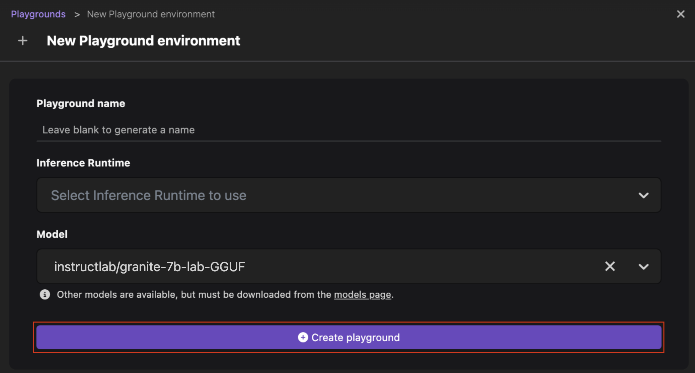
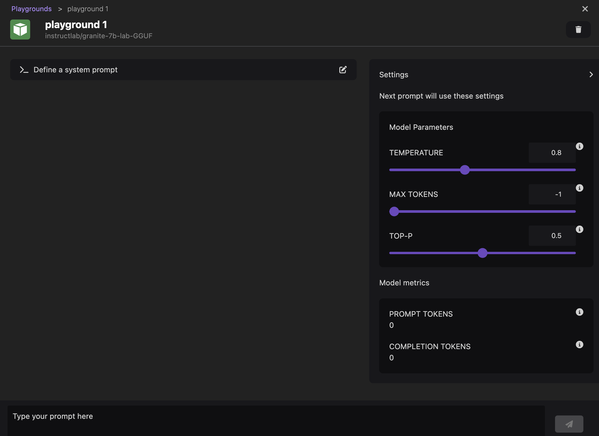

# Creating a playground

The integrated Playground environments allow for experimenting with available models in a local environment. An intuitive user prompt helps in exploring the capabilities and accuracy of various models and aids in finding the best model for the use case at hand. The Playground interface further allows for parameterizing models to further optimize the settings and attributes of each model.

#### Prerequisites

- [Podman AI Lab installed](/docs/ai-lab/installing).
- [Model downloaded](/docs/ai-lab/download-model).
- [An inference server created for a model](/docs/ai-lab/start-inference-server).

#### Procedure

1. Click the Podman AI Lab icon in the left navigation pane.
1. In the Podman AI Lab navigation bar, click **Playgrounds**.
1. Click the **New Playground** button at the top right corner of the page.
1. Select an inference runtime for the playground.
1. Select the model for which you want to start an inference server from the **Model** list.
1. Click the **Create playground** button.
   

#### Verification

1. View the created playground on the same page.
   
1. Click the name of the playground to experiment with model settings. The Playground page opens.
1. Perform any of the following tasks:
   - Edit the value of the model parameters.
   - Add a system prompt by clicking the **Edit system prompt** icon.
   - Enter your question in the prompt box and analyze the accuracy of the answer.
     
