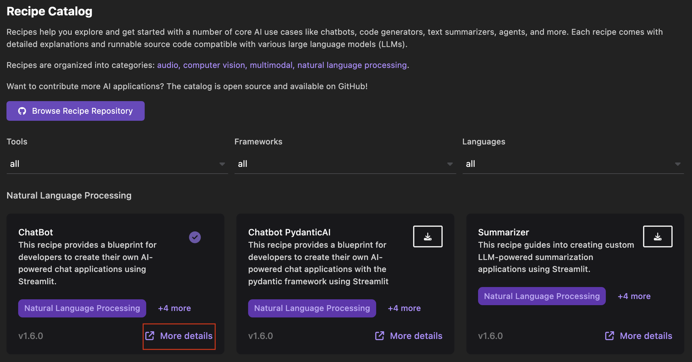
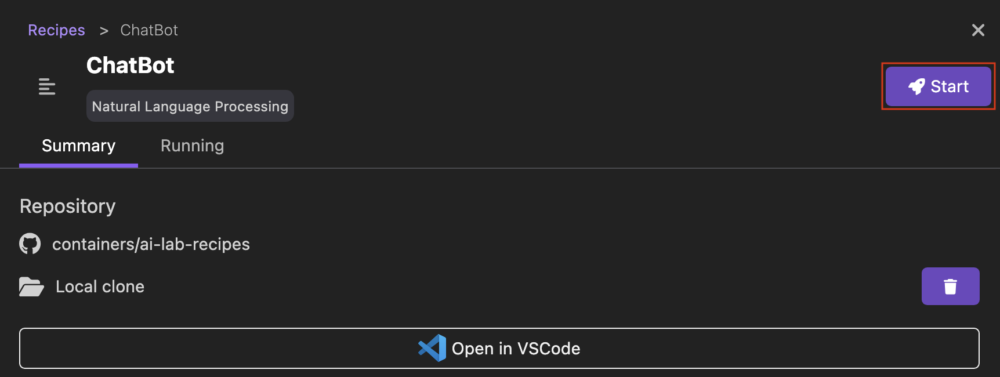
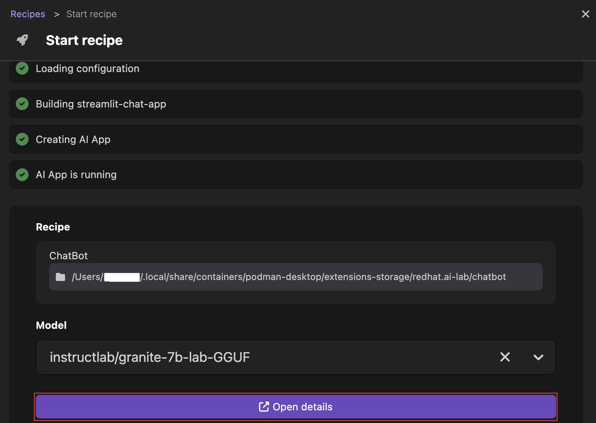

# Starting a recipe (inference server) for a model

Once an AI model is available through a well known endpoint, it's easy to imagine a new world of applications that will connect and use the AI model. Podman AI Lab support AI applications as a set of containers that are connected together.

Podman AI Lab ships with a so-called Recipes Catalog that helps you navigate a number of core AI use cases and problem domains, such as chatbots, code generators, and text summarizers. Each recipe includes detailed explanations and sample applications that can be run with various large language models (LLMs). Experimenting with multiple models allows you to find the optimal one for your use case.

#### Prerequisites

- [Podman AI Lab installed](/docs/ai-lab/installing).
- [Model downloaded](/docs/ai-lab/download-model).

#### Procedure

1. Click the Podman AI Lab icon in the left navigation pane.
1. In the Podman AI Lab navigation bar, click **Recipe Catalog**.
1. Optional: Filter the recipe catalog based on the required tool, framework, or programming language.
1. Click the **More details** link for the recipe that you want to start. The recipe summary page opens.
   
1. Click **Start**. The Start recipe page opens.
   
1. Select a model from the dropdown list.
1. Click **Start ChatBot recipe**. This step might take some time to pull the recipe, copy the model to your Podman machine, start the inference server, load configurations, and create the application.

#### Verification

1. Click **Open details** after the processing completes.
   
1. View the created AI application.
1. Click the **Open AI APP** icon to view the running application in your browser.
   
