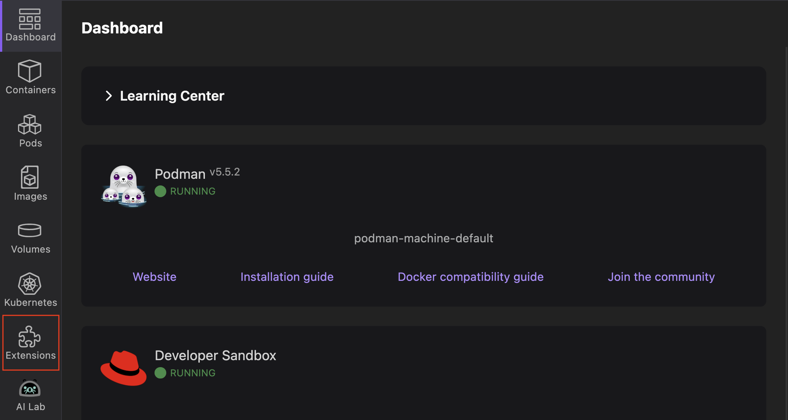
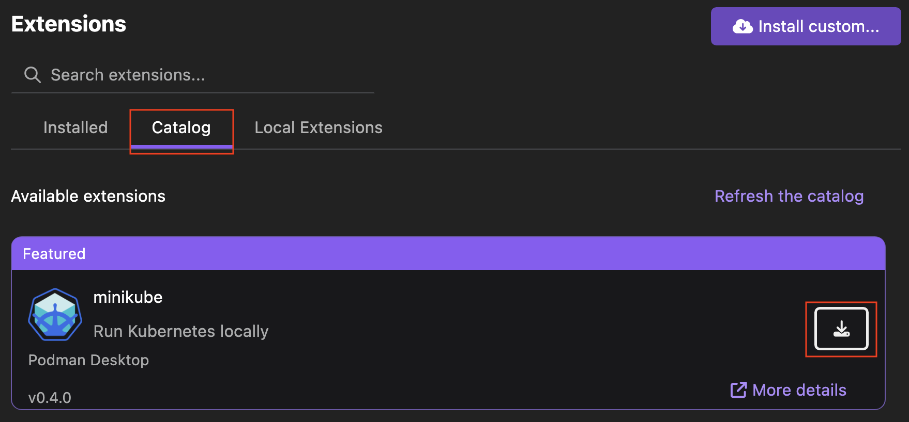
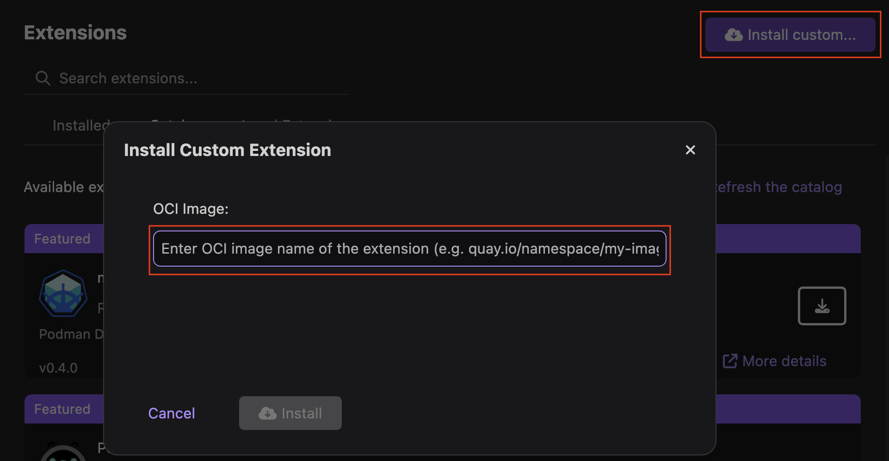
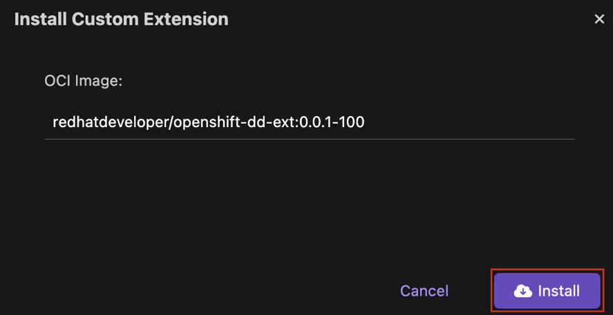
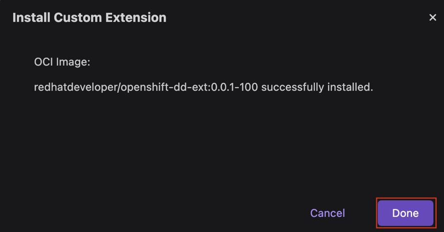

# Installing a Podman Desktop extension

Installing an extension is a great way to expand the capabilities of Podman Desktop. You have the option to install an extension from the catalog or a custom extension of your choice.

#### Procedure

1. Click the **Extensions** button. <!-- markdownlint-disable-line MD029 -->

   

2. Perform one of the following steps:

   - Browse the **Catalog** and install the required extension. <!-- markdownlint-disable-line MD029 -->

     

   - Click the **Install custom...** button to install an extension from a container image: <!-- markdownlint-disable-line MD029 -->
     1. Go to any registry, such as Docker Hub, GitHub, or any other registry.
     1. Find your extension.
     1. Copy the OCI image name of the extension, such as `redhatdeveloper/openshift-dd-ext:0.0.1-100`, and paste it into the **OCI Image** field.
        
     1. Click **Install**. A successful operation notification opens.
        
     1. Click **Done**.
        

#### Verification

- The extension can be verified by checking the **Installed** section of the Extensions page.

- Depending on the extension, items can appear in the status bar, tray menu, or other areas of Podman Desktop.
