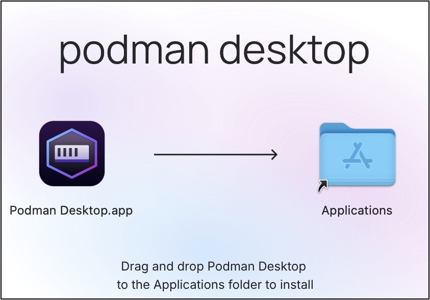
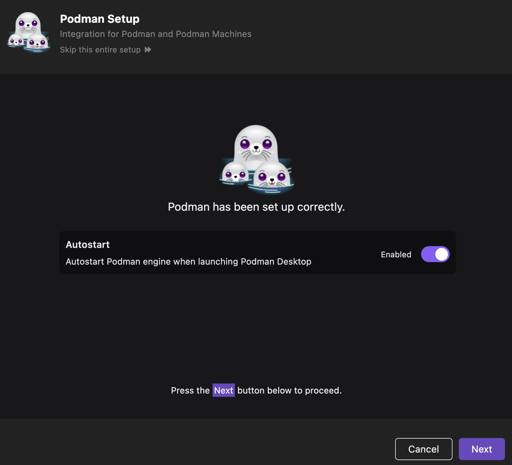
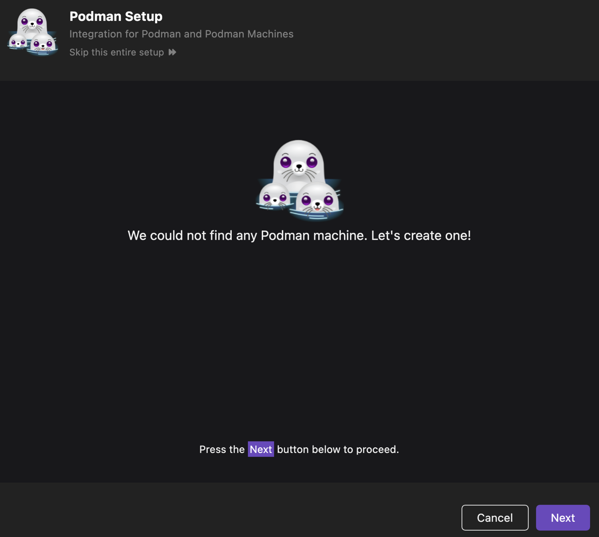

# MacOS

:::info[Prerequisite]
Podman Desktop requires the [Podman engine](https://docs.podman.io/en/latest/index.html). If you do not have the Podman engine installed, Podman Desktop will prompt you to do so when you open it.
:::

You can install Podman Desktop on macOS by using:

- The .dmg installer file: This is the recommended way to install Podman Desktop, Podman, and Podman CLI smoothly.
- Homebrew: This is an alternative way, but it is not recommended, as there is no guarantee of the stability of Brew installs of Podman and Podman Desktop.

  :::note

  If you have already installed Podman using Homebrew, perform one of the following steps to avoid any unexpected results when using Podman Desktop:
  - Uninstall Podman through Homebrew before using the recommended .dmg installer.
  - Do not use the .dmg installer to install Podman Desktop. Instead, use Homebrew only.

  :::

## Installing Podman Desktop using the .dmg file: Recommended

1. Download the `.dmg` file from the [Downloads](/downloads/macos) section of the website.

   :::note

   While we recommend getting the "universal" binary file, which will work irrespective of the chip architecture your Mac possesses, you also have the option to download the applicable .dmg file depending on your Mac hardware architecture (that is, Intel or Apple M1).

   :::

1. Locate the downloaded file, and double-click on it. Usually, you will find the downloaded file in the Downloads folder.

1. Drag the Podman Desktop application and drop it to the `Applications` folder.

   

1. Start Podman Desktop from the 'Launchpad' or Mac's `Applications` directory. The Dashboard page opens with a notification to set up Podman.

1. Click **Set up** to install Podman from Podman Desktop.
   

1. Click **Next**. A confirmation notification to install Podman opens.
1. Click **Yes**. The Podman Installer screen opens.
1. Follow the instructions on the screen, enter your system password when prompted, and click **Install Software**.

   

1. Click **Close** on the screen. A page notifying that Podman has been set up correctly opens.
1. Click **Next**. A page notifying you to create a Podman machine opens.
   
1. Click **Next**, and then click **Create**.
   
1. Click **Next** to navigate back to the Dashboard page.

Podman Desktop installation is now complete. The Podman engine is installed, and the Podman machine is created. You are ready to use the application.

## Installing Podman Desktop using Homebrew: Not recommended

:::info[Prerequisite]

- [Homebrew](https://brew.sh/)

  :::

### Installation steps

1. Open a terminal on your Mac.
2. Run the following command:

   ```sh
   brew install --cask podman-desktop
   ```

   Homebrew will also install the Podman engine along with the Podman Desktop application in case you do not have it installed.

   After the command is executed, you can find the Podman Desktop application in the `Applications` directory of macOS.

## Getting Started

Learn more on how to get started with Podman Desktop by clicking [here](/docs/containers).
