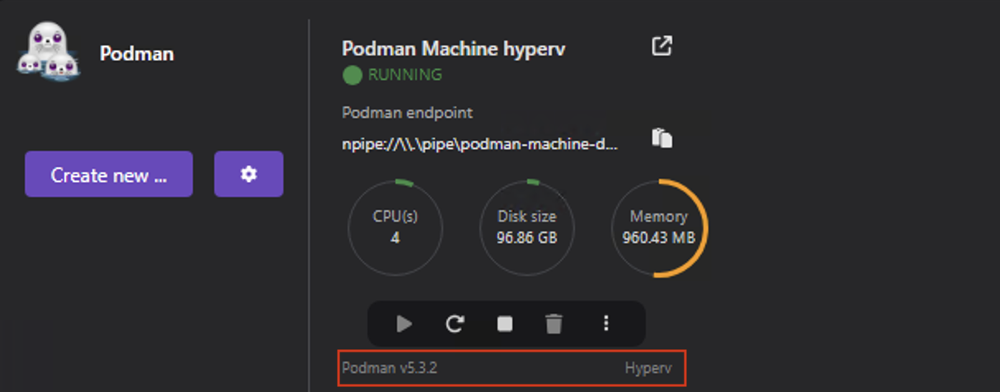

# Installing Podman Desktop and Podman on Windows

You can install Podman Desktop by using:

- The installer
- Other alternative methods

## Installing Podman Desktop

1. [Download the Windows installer](/downloads/windows).

1. Locate the file in the Downloads folder, and double-click on it. The Podman Desktop Setup screen opens.

   

1. Select one of the installation options.
1. Click **Install**. Wait for the installation to complete.
1. Click **Finish** to close the screen. The Podman Desktop onboarding screen opens.

<details>
<summary>
Alternate installation methods:
- Silent Windows installer
- Chocolatey
- Scoop
- Winget
</summary>

#### Silent Windows installer

1. [Download the Windows installer](/downloads/windows).

1. To install without user interaction, run the Windows installer with the silent flag `/S` from the Command Prompt:

   ```shell-session
   > podman-desktop-1.6.4-setup-x64.exe /S
   ```

#### Chocolatey

1. Install the [Chocolatey package manager](https://chocolatey.org/install).

1. Install from the terminal:

   ```shell-session
   > choco install podman-desktop
   ```

#### Scoop package manager for Windows

1. [Install the Scoop package manager](https://github.com/ScoopInstaller/Install#readme).

1. Install from the terminal:

   ```shell-session
   > scoop bucket add extras
   > scoop install podman-desktop
   ```

#### Winget

1. [Install the Winget Package manager for Windows](https://aka.ms/getwinget).

1. Install from the terminal:

   ```shell-session
   > winget install -e --id RedHat.Podman-Desktop
   ```

</details>

## Installing Podman

On Windows, running the Podman container engine requires running a Linux distribution on a virtual machine.

### Use WSL2 as machine provider

Podman Desktop creates a [Windows Subsystem for Linux version 2 (WSL 2)](https://learn.microsoft.com/en-us/windows/wsl/about#what-is-wsl-2) virtual machine: the Podman Machine.

Main benefits are:

- Ease of use.
- WSL 2 native virtualization performance.

#### Prerequisites

Check that your environment has:

- 6 GB RAM for the Podman Machine.
- Windows Subsystem for Linux version 2 (WSL 2) prerequisites. See [Enabling WSL 2](https://docs.microsoft.com/en-us/windows/wsl/install), [WSL basic commands](https://learn.microsoft.com/en-us/windows/wsl/basic-commands), and [Troubleshooting WSL 2](https://learn.microsoft.com/en-us/windows/wsl/troubleshooting#error-0x80370102-the-virtual-machine-could-not-be-started-because-a-required-feature-is-not-installed):
  - The Windows user has administrator privileges.
  - Windows 64bit.
  - Windows 10 Build 19043 or greater, or Windows 11.
  - On a virtual machine: [Nested Virtualization enabled](https://learn.microsoft.com/en-us/virtualization/hyper-v-on-windows/user-guide/nested-virtualization#configure-nested-virtualization).

#### Procedure: Enable the WSL feature

1. To prepare your system, enable the WSL feature, without installing the default Ubuntu distribution of Linux.

   Open the Command Prompt, and run:.

   ```shell-session
   > wsl --update
   > wsl --install --no-distribution
   ```

   :::note

   If you run the Podman Desktop setup on a Windows 10 LTSC version, you require to install a specific WSL distribution. See [Troubleshooting Podman on Windows](/docs/troubleshooting/troubleshooting-podman-on-windows#windows-10-enterprise-ltsc-version-21h2-podman-desktop-is-unable-to-detect-wsl2-machine)

   :::

1. Restart your computer.

#### Procedure: Install Podman Desktop dependencies

After Podman Desktop installation, the **Get started with Podman Desktop** page opens to help you start onboarding. Note that you can completely skip this onbaording setup and do it later by using the set up button shown on the Dashboard page or the Resources page.


1. Set up Podman and create the Podman machine:
   1. Click the **Start onboarding** button.
   1. Click **Next**. A confirmation notification to install Podman opens.
   1. Click **Yes**. The Podman Setup screen opens with the default WSLv2 virtulization provider selected. You can change the virtualization provider if needed
   1. Click **Install**. A notification stating `Installation Successfully Completed` appears on the screen.
   1. Click **Close**. A page notifying that Podman has been set up correctly opens.
   1. Click **Next**. A page notifying you to create a Podman machine opens.
   1. Click **Next**, and then click **Create**.
   1. Click **Next**.
1. Perform one of the following steps:

- Follow the instructions on the screen to download and install `Kubectl` and `Compose` CLIs.
- Click the Skip button to install them later when needed.

The Dashboard page opens. You are now ready to use the application.

To verify that Podman is set up:

- In the **Dashboard**, the **Podman** tile displays _Podman is running_.

  

### Use Hyper-V as machine provider

As an administrator, you can set up a Podman machine using Hyper-V as the machine provider type. To do so, select `hyperv` from the **Provider Type** dropdown list when [creating a Podman machine](/docs/podman/creating-a-podman-machine).

:::note

If you already have a running Podman machine with the WSL provider type, you will be prompted to set the Hyper-V machine as the default machine to avoid CLI errors.

:::

#### Verification

1. Go to **Settings > Resources**.
1. View the created machine in the Podman tile.
   

#### Next steps

- [Work with containers](/docs/containers).
- [Work with Kubernetes](/docs/kubernetes).
