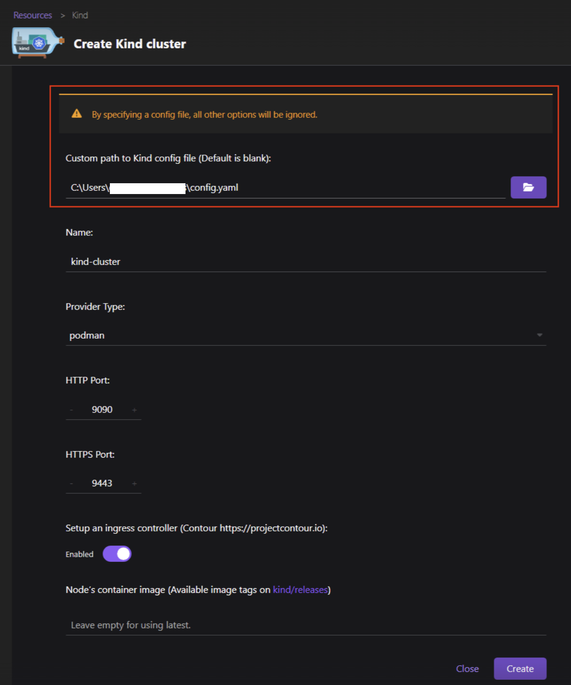
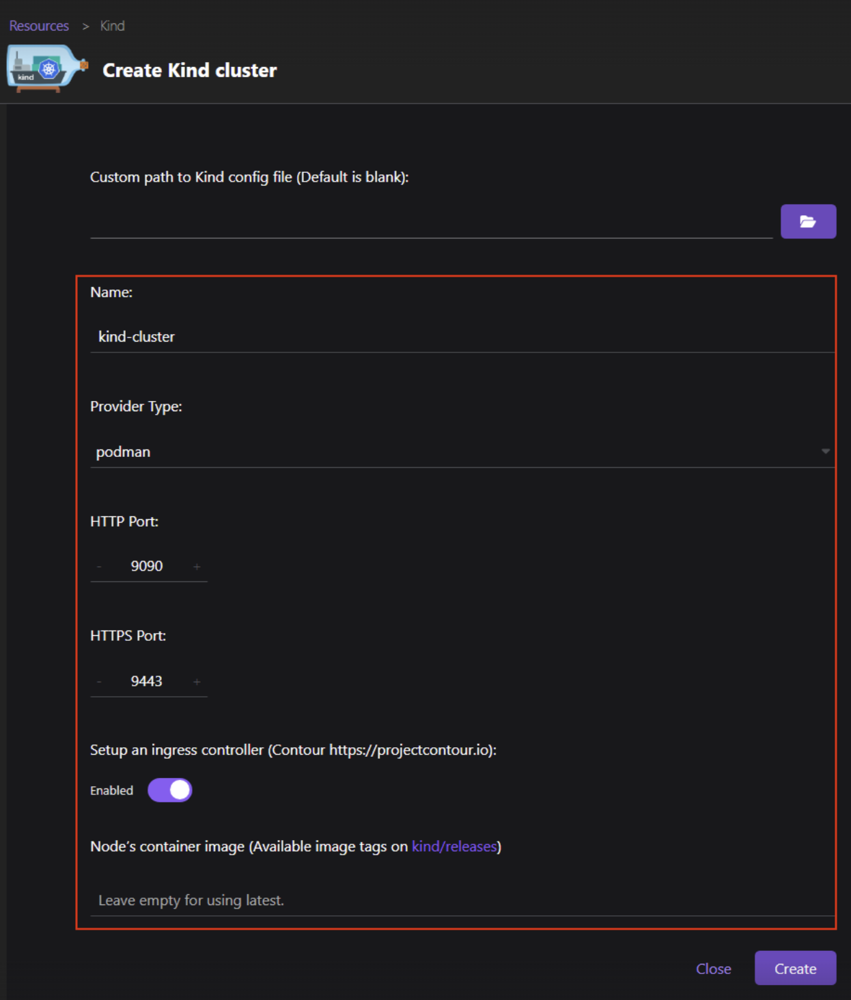

# Creating a local Kind-powered Kubernetes cluster

You can create multiple local Kind-powered Kubernetes clusters.

#### Prerequisites

- [On Windows, you configured Podman](/docs/kind/configuring-podman-for-kind-on-windows).
- [You installed Kind](/docs/kind/installing).

  :::note

  If you have not installed the Kind CLI, you will be prompted to install it when you create a Kind cluster.

  :::

#### Procedure

1. Go to **<Icon icon="fa-solid fa-cog" size="lg" /> Settings > Resources**
1. In the Kind tile, click the **Create new ...** button.
1. Perform one of the following steps:
   - Create a Kind cluster with a _customized_ configuration by providing a path to the configuration file. The Kind cluster is created based on the values specified in the configuration file.
     

     :::note

     When you provide the configuration file, the values specified in that file take precedence over the default values.

     :::

   - Create a Kind cluster with the _default_ configuration. However, you can edit the default configuration, if needed. For example, you can edit the port number or any other configuration details.
     

1. Click the **Create** button.
1. Optional: Click the **Show logs** button to view the logs.
1. After successful creation, click the **Go back to resources** button.

#### Verification

1. Go to **<Icon icon="fa-solid fa-cog" size="lg" /> Settings > Resources**, and view your running `<kind-cluster>` instance in the **Kind** tile.
   
1. In the Podman Desktop tray, select the **Kubernetes** menu; you can set the context to your Kind cluster: `kind-<kind-cluster>`.

   :::note

   Alternatively, use the status bar or the Podman Desktop **Settings** to set your Kubernetes context. For more details, see [Viewing and selecting the current Kubernetes context](/docs/kubernetes/viewing-and-selecting-current-kubernetes-context).

   :::
