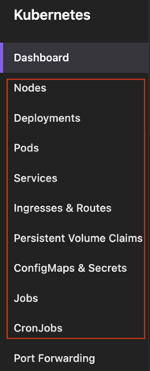

# Managing Kubernetes objects

With Podman Desktop, you can easily transition from containers to Kubernetes and deploy a local Kubernetes environment with necessary objects. As a developer, you have the ability to:

- Manage your application resources visually.
- Configure the following Kubernetes objects:
  - `Node`: Use this object to set up a node on which the necessary pods can run within a kubernetes cluster.
  - `Deployment`: Use this object to create necessary pods for execution and scale the number of pods.
  - `Pod`: Use this object to create a set of one or more containers with shared storage and network resources.
  - `Service`: Use this object to expose your application to users and define policies for application access.
  - `Ingress`: Use this object to define routing rules and manage user access to the services running in a Kubernetes cluster.
  - `PersistentVolumeClaim`: Use this object to request `PersistentVolume` resources for storage and define volume access modes within your Kubernetes cluster.
  - `ConfigMap`: Use this object to define non-sensitive configuration data for initializing or executing your application.
  - `Secret`: Use this object to store and manage sensitive data, such as passwords, OAuth tokens, and SSH keys for your application.
  - `CronJob`: Use this object to run a job, such as backup and report generation periodically on a given schedule.
- View and analyze real-time information about the connection status of the resources configured within the cluster.
- View the dashboard for analyzing object metrics and reading Kubernetes articles and blog posts.
- Get resource details using the _Summary_ and _Inspect_ tabs.
- Edit and apply configuration changes directly using the _Kube_ tab.
- Select multiple configuration files and apply them to your cluster in a single step.
- Configure port forwarding for a Kubernetes service and view the port forwarding details.

#### Prerequisites

- A valid [Kubernetes context and connection](/docs/kubernetes/viewing-and-selecting-current-kubernetes-context).
- A pod creation example for reference:

```yaml
apiVersion: v1
kind: Pod
metadata:
  name: my-pod
spec:
  containers:
    - name: my-container
      image: nginx:1.14.2
      ports:
        - containerPort: 80
```

#### Procedure: Creating an object

1. Go to the **Kubernetes** component page.
2. Click one of the options to open the object page.

   

3. Click the **Apply YAML** button and select an object configuration file. A confirmation notification opens.
   
4. Click **Ok**.

#### Procedure: Updating an existing object

1. Go to the **Kubernetes** component page.
2. Click one of the options to open the object page.
3. Click the name of the object.
4. Select the **Kube** tab and edit the configuration file.
   
5. Click **Apply changes to cluster**.

#### Verification

1. View the created object:

   - View the `Pod` object on the **Kubernetes > Pods** object page.
   - View other Kubernetes objects on the related object page. For example, if you have created a `Node` object, you can view it on the **Kubernetes > Nodes** page.

2. Optional: Click the name of the object to view its detailed summary.
   
