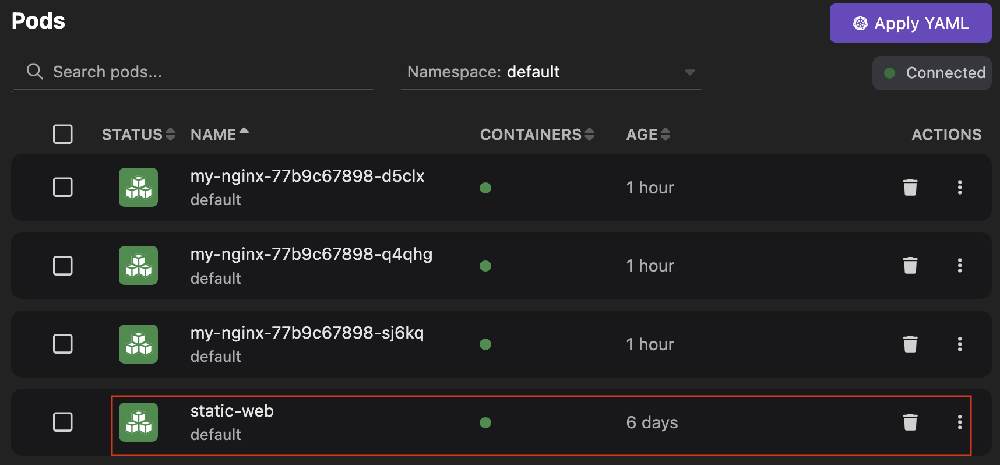

# Configuring port forwarding

Within a Kubernetes cluster, you can access an application by its internal IP address. But, if you want to access the application from your local machine, use the port forwarding feature. Using UI, you can forward a local port to a port on the pod that runs your application. This way you can interact with the application running in a Kubernetes cluster from your local machine for debugging and testing purposes.

You can use the port forwarding feature for the pods and services running on a Kubernetes cluster. Also, you can perform port forwarding for any exposed ports.

#### Prerequisites

Make sure you have:

- A [running Podman machine](/docs/podman/creating-a-podman-machine).
- A running Kubernetes cluster, such as [Kind](/docs/kind/creating-a-kind-cluster) or [Minikube](/docs/minikube/creating-a-minikube-cluster).
- Connected to the cluster.
  - Go to **Settings > Kubernetes**, and click **Connect** in the cluster tile.
- Created a YAML configuration file with an exposed port:

```yaml
apiVersion: v1
kind: Pod
metadata:
  name: static-web
spec:
  containers:
    - image: nginx
      name: web
      ports:
        - containerPort: 80
          name: web
          protocol: TCP
```

#### Procedure: Start port forwarding

1. Create a Kubernetes pod:

   1. Go to the **Pods** component page.
   1. Click **Play Kubernetes YAML**.
      
   1. Select a Kubernetes YAML file, such as `pod.yaml` from your local machine.
   1. Set the **Runtime** field to `Kubernetes cluster`.
      
   1. Click **Play** and then **Done**.
   1. Go to **Kubernetes > Pods** to view the created Kubernetes pod.
      
   1. Click the name of the pod and view the **Summary** tab.

1. Click the **Forward...** button corresponding to the port you want to use for port forwarding.
   
1. Click the **Open** button to view the running application in a web browser.
   

   :::note

   You can also start port forwarding from the **Kubernetes > Services** component page. After creating a service, click the name of the service and configure port forwarding in the **Summary** tab.

   :::

#### Procedure: Stop port forwarding

You can stop port forwarding by using one of the following ways:

**_Use the Pods or Services page_**

1. Go to the **Kubernetes > Pods** or **Kubernetes > Services** page.
1. Click the name of the Kubernetes pod or service for which you want to stop port forwarding.
1. Click **Remove** in the Summary tab. The entry is removed from the **Kubernetes > Port Forwarding** page.
   

**_Use the Port Forwarding page_**

1. Go to the **Kubernetes > Port Forwarding** page.
1. Click the **Delete** icon corresponding to the pod or service for which you want to stop port forwarding. The entry is removed from the page.
   

#### Verification

1. Go to the **Kubernetes > Port Forwarding** page.
1. View the port forwarding details for Kubernetes pods and services.
   
