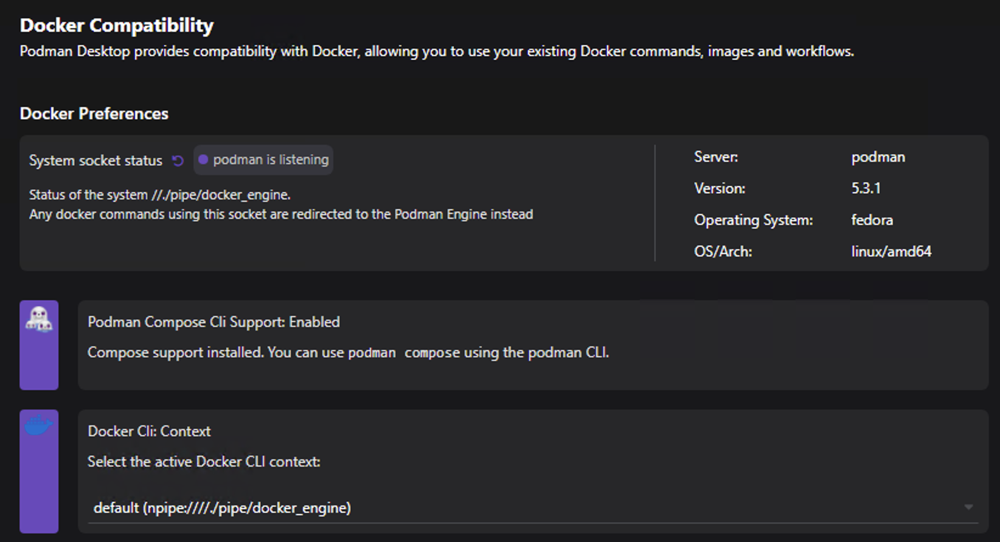

import Tabs from '@theme/Tabs';
import TabItem from '@theme/TabItem';

# Managing Docker compatibility - Experimental feature

With Podman Desktop, you can configure a Docker-compatible environment using the **Settings** page. After configuration, your Docker tools are directed to use a Podman engine and your Compose applications can be run using the Podman CLI.

As a developer, you can:

- Check the system socket mapping status to know whether the socket is reachable. The default socket path is:

  - _/var/run/docker.sock_ on macOS and Linux
  - _npipe:////./pipe/docker_engine_ on Windows

- Use all Docker tools, including CLI, with the Podman engine without any reconfiguration. These tools connect to the default Podman socket, thereby enabling you to use all Docker commands with Podman. For example, you can run the `docker run` command on the Podman engine to start a container.

  - On macOS, the **Third-Party Docker Tool Compatibility** setting is enabled by default.
  - On Windows and Linux, the **Third-Party Docker Tool Compatibility** setting is not available. You can [use the `DOCKER_HOST` environment variable](/docs/migrating-from-docker/using-the-docker_host-environment-variable) to let your tools communicate directly with the Podman socket.

- Use the Podman CLI to run Compose applications by installing and setting up the [Compose extension](/docs/compose). For example, you can run the `docker compose up` command on the Podman engine to start your Compose v2 application. Also, ensure to place your Docker Compose file in a working directory, such as your home directory.

  - If the Compose CLI is not installed, you get the install option in the settings.

- Select and use a Docker-compatible socket context. You can also view the socket details, such as name and socket path.

#### Prerequisites

Make sure you have:

- [A running Podman machine](/docs/podman/creating-a-podman-machine).
- Enabled the [Docker compatibility](/docs/migrating-from-docker/customizing-docker-compatibility#enable-docker-compatibility) feature.

<Tabs>
   <TabItem value="win" label="Windows" className="markdown">

#### Procedure

1. Go to **Settings > Docker Compatibility**.
2. **System socket status** setting: View the socket mapping status to check whether the socket is reachable.
3. **Docker CLI Context** setting: Select a socket context to work with from the dropdown list.
4. **Podman Compose CLI Support** setting: Check whether the Podman Compose CLI is supported. If not, use the **Setup...** button to install and set up the CLI.
   

</TabItem>
<TabItem value="macOS" label="macOS" className="markdown">

#### Procedure

1. Go to **Settings > Docker Compatibility**.
2. **System socket status** setting: View the socket mapping status to check whether the socket is reachable.
3. **Docker CLI Context** setting: Select a socket context to work with from the dropdown list.
4. **Podman Compose CLI Support** setting: Check whether the Podman Compose CLI is supported. If not, use the **Setup...** button to install and set up the CLI.
5. **Third-Party Docker Tool Compatibility** setting: Customize the setting, if needed. When enabled, you can use third-party Docker tools with Podman.
   

</TabItem>
<TabItem value="linux" label="Linux" className="markdown">

#### Procedure

1. Go to **Settings > Docker Compatibility**.
2. **System socket status** setting: View the socket mapping status to check whether the socket is reachable.
3. **Docker CLI Context** setting: Select a socket context to work with from the dropdown list.
4. **Podman Compose CLI Support** setting: Check whether the Podman Compose CLI is supported. If not, use the **Setup...** button to install and set up the CLI.
   

</TabItem>
</Tabs>

#### Verification

- Run `podman` or `podman compose` commands for your Compose applications to check if they run fine.
