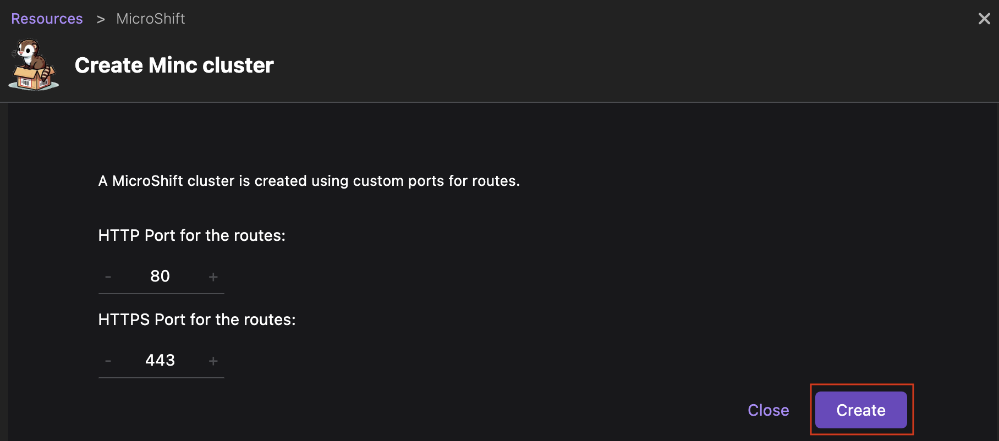

# Creating a MicroShift cluster

With Podman Desktop, you can use the MicroShift in a Container (MINC) extension to create a lightweight OpenShift Kubernetes cluster that runs on minimal resources, such as CPU, RAM, and storage. The cluster is deployed as a container within your Podman environment and resembles a miniaturized version of OpenShift. After setting up a MicroShift cluster, you can:

- Develop OpenShift applications in a resource-constrained environment.
- Provision lightweight OpenShift control planes.
- Run your OpenShift workloads at the edge or even in network-constrained situations, such as low connectivity or node access issues.
- Access the images built with Podman from your cluster.
- Have a consistent development and management experience with an OpenShift cluster.

#### Prerequisites

- A running [Podman machine](/docs/podman/creating-a-podman-machine) with root privileges.
- [Install the MINC extension](/docs/extensions/install).
- On Windows: [Enable the `cgroup v2` kernel feature](https://learn.microsoft.com/en-us/windows/wsl/wsl-config) in the Windows Subsystem for Linux (WSL).
  1. Open the `.wslconfig` file located in the `%UserProfile%` directory.
  1. Append the kernel command-line argument `cgroup_no_v1=all` to the `kernelCommandLine` key under the `[wsl2]` section.

#### Procedure: Create a MicroShift cluster

1. Go to **Settings > Resources**.
1. In the MicroShift tile, click the **Create new ...** button.
   
1. Optional: Edit the port number for the routes.
1. Click **Create**.
   
1. Optional: Click the **Show Logs** button to view the logs.
1. After successful creation, click the **Go back to resources** button.

#### Verification

- On the **Settings > Resources** page, your MicroShift instance is running.
  
- [Set your current context](/docs/kubernetes/viewing-and-selecting-current-kubernetes-context) to `microshift` for Kubernetes development.
- Run basic tasks, such as [deploying a pod or container](/docs/kubernetes/deploying-a-pod-to-kubernetes) to Kubernetes.

#### Additional resources

- [minc-extension repository](https://github.com/minc-org/minc-extension)
- [MINC blog](/blog/iterate-quickly-inner-loop-with-a-kubernetes-cluster)
