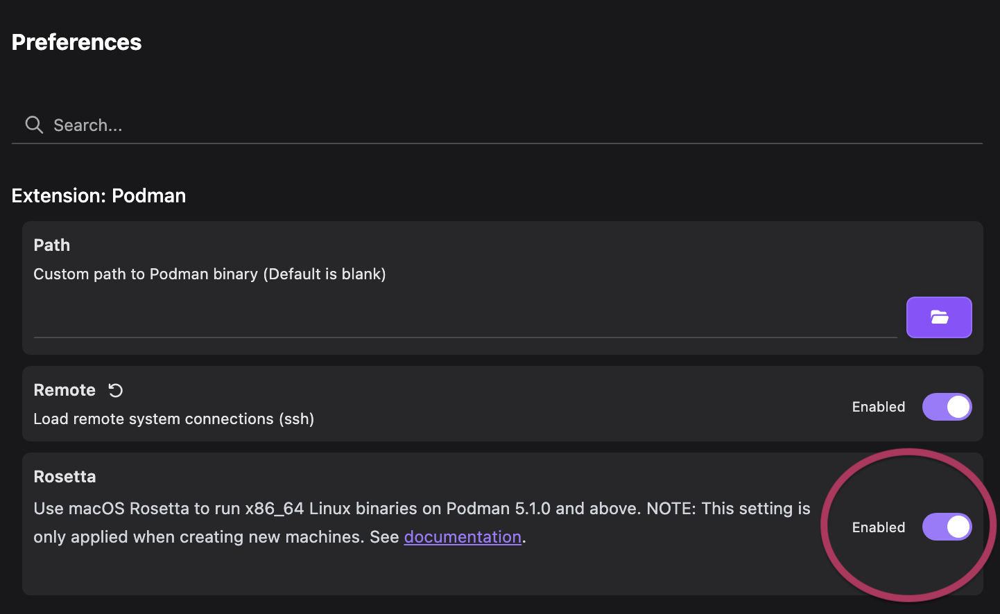
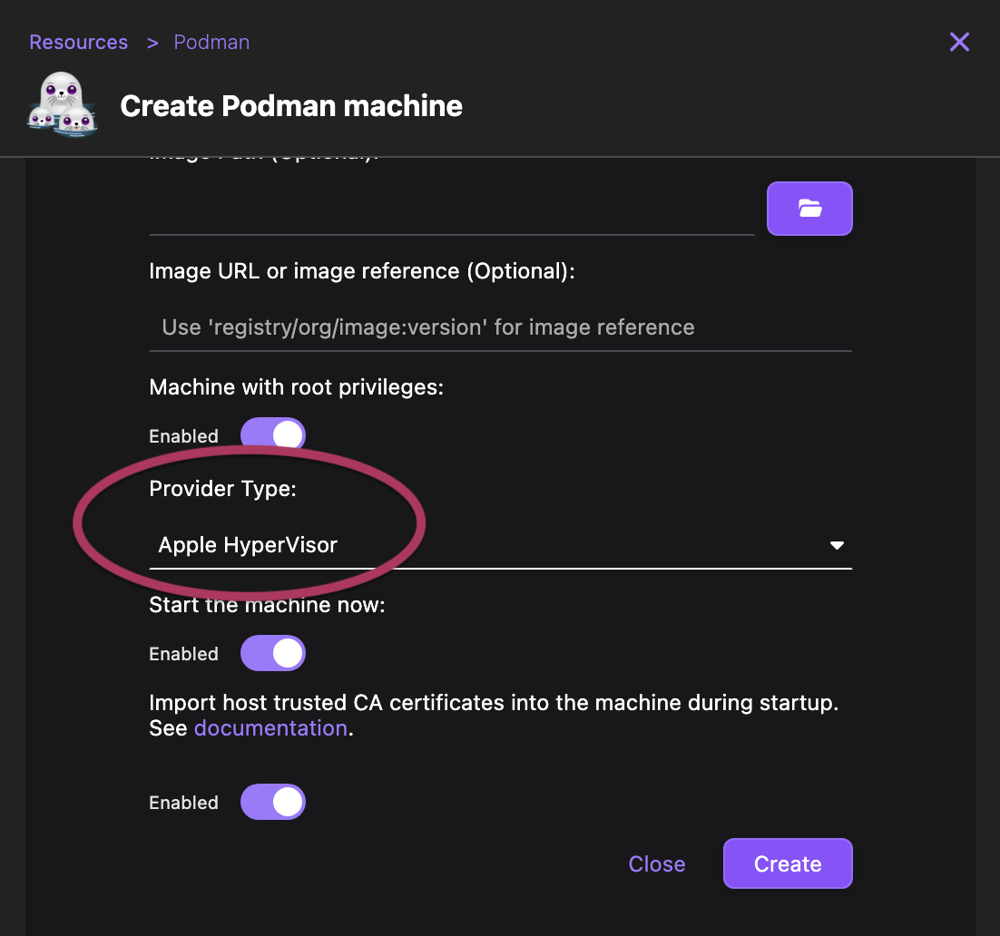

# Native Apple Rosetta translation layer

On macOS, the Podman machine can use the native Apple hypervisor `applehv` with Rosetta. This increases the speed of any `x86_64` builds or containers to near-native levels by using a translation layer.

New Podman installations use the `libkrun` hypervisor by default. It is not compatible with Rosetta and uses [qemu](https://www.qemu.org/) for `x86_64`.
Rosetta is enabled by default on all new installations, but you need to recreate your Podman machine to use the `applehv` hypervisor.

#### Prerequisites

- Apple silicon
- macOS 26 or later
- Podman 5.1.0 or later

#### Procedure

To enable Rosetta support, re-create your Podman machine instance:

1. Stop and remove your existing Podman machine from **Settings > Resources** or from a terminal:

   ```shell-session
   $ podman machine stop
   $ podman machine rm
   ```

2. Open **Settings > Preferences**, find the Podman Rosetta option and ensure it is set to **Enabled**.

   

3. Create your Podman machine with the Apple Hypervisor (`applehv`).

   From a terminal:

   ```shell-session
   $ podman machine init --provider applehv
   ```

   From **Settings > Resources**:

   

#### Verification

To verify that Rosetta has been enabled or disabled, check your `~/.config/containers/containers.conf` configuration.

You will see the `rosetta` configuration parameter with either `true` or `false`. If the parameter does _not_ exist, Rosetta is already enabled by default.

#### Additional resources

- [Creating a Podman machine](/docs/podman/creating-a-podman-machine)
- [Official Apple Rosetta documentation](https://developer.apple.com/documentation/virtualization/running_intel_binaries_in_linux_vms_with_rosetta)
