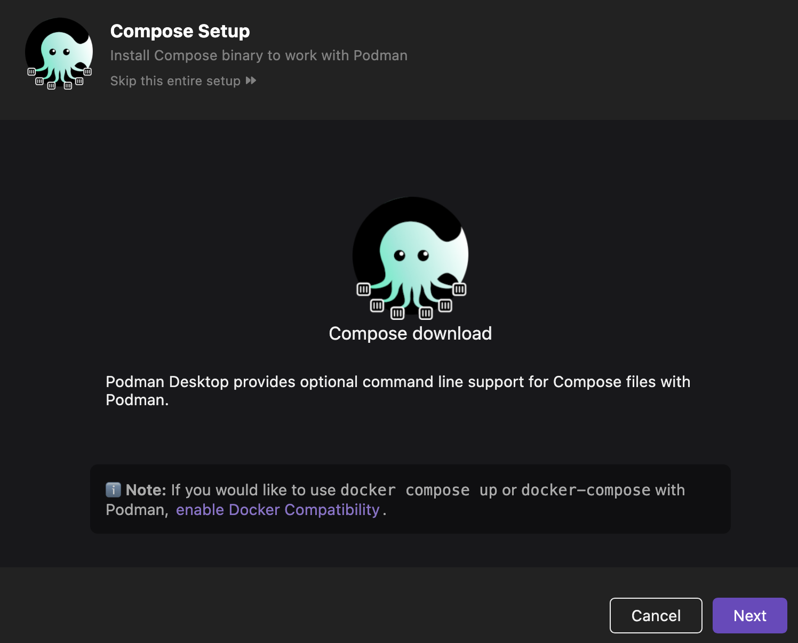
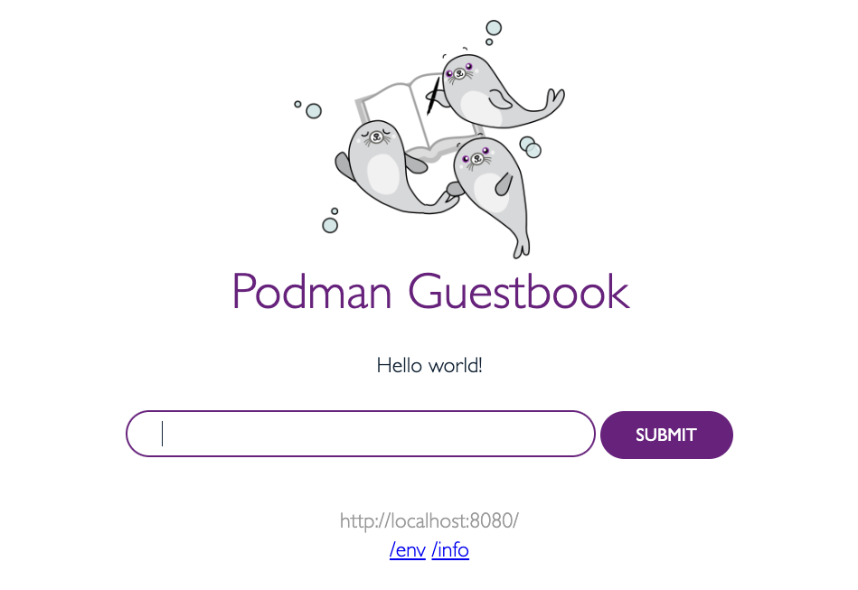
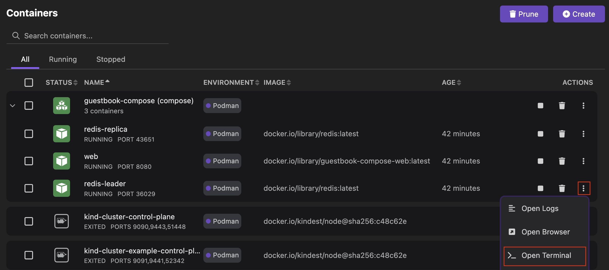
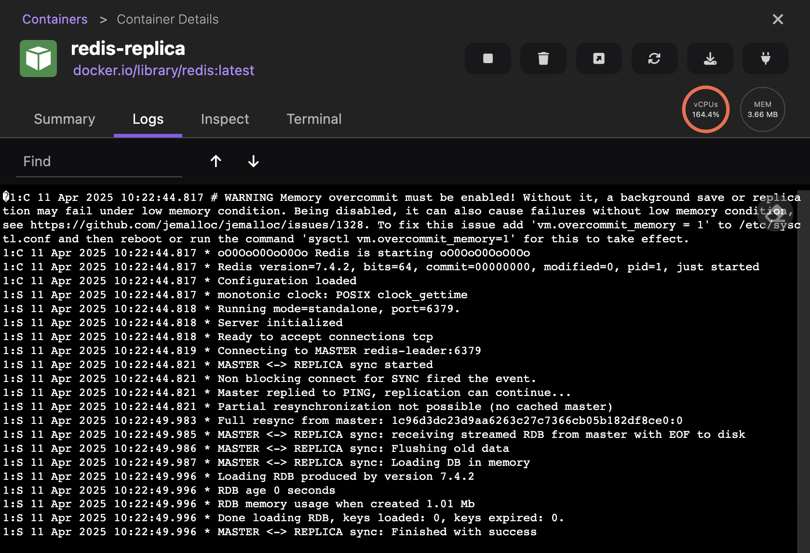

# Getting started with Compose

[Compose is a specification](https://www.compose-spec.io/) for defining and running multi-container Docker applications. With Compose, you use a YAML file to configure your application’s services, networks, and volumes. This allows you to capture in a single file the entire configuration necessary to run a set of interconnected containers as an application. For example, if you have an application that requires a web server, a database, and a caching service, you can define these components and their relationships in your Compose file.

To use the Compose YAML, you can leverage a specification implementation, such as [`podman compose`](https://docs.podman.io/en/latest/markdown/podman-compose.1.html) and [`docker compose`](https://github.com/docker/compose).

This tutorial covers the following end-to-end tasks required to use a multi-container Compose application within Podman Desktop:

- [Download and run the example application](/tutorial/getting-started-with-compose#download-and-run-the-example-application) using `podman compose up`.
- [View the guestbook web application](/tutorial/getting-started-with-compose#viewing-the-guestbook-application).
- [View and modify the database](/tutorial/getting-started-with-compose#viewing-and-modifying-the-database) to check the guestbook web application is synchronized and running correctly.
- [Scale database replicas](/tutorial/getting-started-with-compose#scaling-more-replicas).

## Before you begin

If you do not have Compose installed, you can follow the complete onboarding process to install it system wide:

1. Install the Compose extension from the catalog. For more details, see [Installing a Podman Desktop extension](https://podman-desktop.io/docs/extensions/install).
1. Set up Compose and complete the onboarding process to configure it system-wide.
   
1. Check that you are able to run `podman compose`:

   ```sh
   podman compose
   Run compose workloads via an external provider such as docker-compose or podman-compose

   Description:
     This command is a thin wrapper around an external compose provider such as docker-compose or podman-compose.  This means that podman compose is executing another tool that implements the compose functionality but sets up the environment in a way to let the compose provider communicate transparently with the local Podman socket.  The specified options as well the command and argument are passed directly to the compose provider.
   ...
   ```

:::note

If Compose is already installed, you have the option to upgrade or downgrade its version by navigating to the **Settings > CLI Tools** page.

:::

## Download and run the example application

Our example application is located at [github.com/redhat-developer/podman-desktop-demo](https://github.com/redhat-developer/podman-desktop-demo).

1. Run `git clone` to build the Go binary web application:

   ```sh
   git clone https://github.com/redhat-developer/podman-desktop-demo
   cd podman-desktop-demo/guestbook-compose
   ```

1. Run `podman compose up -d` to start the application:

   ```sh
   podman compose up -d
   >>>> Executing external compose provider "/usr/local/bin/docker-compose". Please refer to the documentation for details. <<<<

   [+] Running 3/3
   ✔ Container redis-replica  Started                                                                        0.0s
   ✔ Container web            Started                                                                        0.0s
   ✔ Container redis-leader   Started                                                                        0.0s
   ```

## Viewing the guestbook application

Within Podman Desktop, you can now see that all three containers are up and operational.

1. Click the "Open Browser" button to view the web application:
   

1. Within the Guestbook web application, you can:

   - "Sign" the guestbook, which will write to the Redis leader and synchronize to the replicas.
   - "Read" from the guestbook, which will read from the pool of Redis replicas. This allows for readability even if the Redis leader is unavailable.
   - `/env`: View the container's environment variables.
   - `/info`: View information about the Redis cluster.

     

## Viewing and modifying the database

Using Podman Desktop, you can also access the container's terminal directly from the GUI and modify the database.

1. Click **Open Terminal** to access the `redis-leader` terminal:

   

1. Modify the database as if you are doing database administration:

   1. Run `redis-cli` within the container to access the Redis database.
   2. Type `LPUSH guestbook "Hello World!"` and you will see your web application update in real-time.
   3. Type `DEL guestbook` and you will see that your database drops the `guestbook` key and clears the database.

      

      Changes will reflect in real-time on the guestbook.

You can further modify the database and see the changes propagate to the Redis replicas. For example, view the logs of the `redis-replica`, and you will notice that there are periodic database synchronizations as well as reads to the database:



### How does it work?

A quick overview of how the architecture works in this multi-container scenario:

- Within the Guestbook application, it looks for a database with the names `redis-leader` and `redis-replica` on port `6379`.
- Because it is a Compose application, the containers are connected on the same network. This means that a neighboring container can be network-accessible simply by its container name.

There is a set of environment variables that the web application can modify in the Compose application:

- `REDIS_LEADER`: The default is `redis-leader`.
- `REDIS_REPLICAS`: The default is `redis-replica`. It can be comma-separated, such as `redis-replica-1,redis-replica-2`.
- `REDIS_PORT`: The default is `6379`.
- `SERVER_PORT`: The default is `8080`.

## Scaling more replicas

Want to scale more replicas? This can be achieved by adding an environment variable to your `compose.yaml` and duplicating your `redis-replica` entry.

1. Modify your `compose.yaml` as follows:

   ```yaml
   services:
     redis-leader:
       container_name: redis-leader
       image: redis:latest
       ports:
         - '6379'

     redis-replica:
       container_name: redis-replica
       image: redis:latest
       ports:
         - '6379'
       command: redis-server --replicaof redis-leader 6379

     redis-replica-2:
       container_name: redis-replica-2
       image: redis:latest
       ports:
         - '6379'
       command: redis-server --replicaof redis-leader 6379

     web:
       container_name: web
       build: ./web
       ports:
         - '8080:8080'
   ```

1. Run `podman compose up -d` again to ensure the new container has been added and the new environment variable has propagated:

   ```sh
   podman compose up -d
   >>>> Executing external compose provider "/usr/local/bin/docker-compose". Please refer to the documentation for details. <<<<

   [+] Running 4/4
   ✔ Container redis-replica-2  Started                                                                      0.0s
   ✔ Container redis-leader     Running                                                                      0.0s
   ✔ Container web              Started                                                                      0.0s
   ✔ Container redis-replica    Running                                                                      0.0s
   ```
