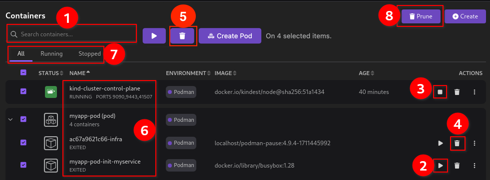
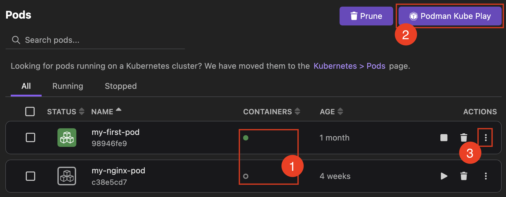
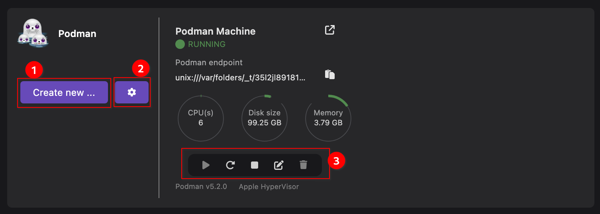

# Managing your application resources

This tutorial covers the tasks that you can perform to manage the following resources visually:

- Containers and pods
- Images
- Volumes
- Kubernetes objects
- Other resources, such as Podman machines, clusters, and CLI tools

Several useful actions are available in the UI to make resource management easy.

## Before you begin

Make sure you have:

- [Installed Podman Desktop](/docs/installation).
- [A running Podman machine](/docs/podman/creating-a-podman-machine).
- [A valid Kubernetes context and connection](/docs/kubernetes/viewing-and-selecting-current-kubernetes-context) to manage Kubernetes resources.

## Managing containers and pods

Based on your needs, perform any of the following actions after navigating to the component page:

**_Common actions for containers and pods_**

1. Search a container or pod using the search box.
2. Start a container or pod using the **Start** icon.
3. Stop a container or pod using the **Stop** icon.
4. Delete a container or pod using the **Delete** icon.

   :::note
   - You cannot delete a container if it is being used in any pods. In such cases, you must delete the pod and then delete the container.

   :::

5. Bulk deletion: Select containers or pods and delete them by using the **Delete** button.
6. Click the name of the container or pod to:
   - View its summary and logs.
   - View its kube configuration if the container or pod is a Kubernetes resource.
   - Interact with the container using a terminal
7. View containers or pods based on their status:
   - Select the **Running** tab to view all running containers or pods
   - Select the **Stopped** tab to view all stopped containers or pods

8. Use the **Prune** button to remove all unused containers or pods from the Podman engine.

**_Container-specific actions_**

1. Use the **Create** button to create a container with a container or docker file or from an existing image.
2. Create a pod with selected containers using the **Create Pod** button.
3. Use the overflow menu to:
   - Open and view logs.
   - _Kubernetes action_: Generate and view configuration for a Kubernetes container.
   - _Kubernetes action_: Deploy a container to a Kubernetes cluster.
   - _Kubernetes action_: Open a browser to check the cluster status.
   - Open a terminal to interact with the container.
   - Restart your container.
   - Export a container to your local machine.
4. Bulk start: Select multiple containers and run them in a single step.

   :::note

   You might see varying options in the overflow menu based on status and configuration of the container.

   :::

**_Pod-specific actions_**

1. View the status of each container by hovering over it in the _CONTAINERS_ column. The status can be `Running`, `Created`, `Exited`, or `Waiting`.
2. Create a pod from a YAML configuration file using the **Podman Kube Play** button.
3. Use the overflow menu to:
   - _Kubernetes action_: Generate and view configuration for a Kubernetes pod.
   - _Kubernetes action_: Deploy a pod to a Kubernetes cluster.
   - Restart your pod.

## Managing images

Perform any of the following actions after navigating to the component page:

1. Search an image using the search box.
2. Create a container from the image using the **Run** icon.
3. Delete an image using the **Delete** icon.

   :::note
   - You cannot delete an image if it is being used in any containers. In such cases, you must delete the container and then delete the image.
   - By selecting multiple images, you can delete or save them in a single step.

   :::

4. Use the overflow menu to:
   - Push an image to a configured registry.
   - Edit the image name and tag.
   - View history to check the commands that created each layer of the image.
   - Save an image to your local machine.
   - Push an image to a cluster, such as a Kind or Developer Sandbox cluster.

5. Access other useful actions:
   - Use the **Prune** button to remove all unused images from the Podman engine.
   - Load images from a tar archive on your local machine.
   - Import images from your local machine into the Podman Desktop application.
   - Pull an image from a configured registry.
   - Build an image from a container or docker file.

## Managing volumes

Perform any of the following actions after navigating to the component page:

1. Search a volume using the search box.
2. Use the **Delete** icon to delete a volume. You can also select multiple volumes and delete them in one step by using the delete button on the page.

   :::note
   - You cannot delete a volume if it is being used in any containers. In such cases, you must delete the container and then delete the volume.
   - By selecting multiple volumes, you can delete them in a single step.

   :::

3. Click the name of the volume to view its summary.
4. Access other useful actions:
   - Use the **Prune** button to remove unused volumes from the Podman engine.
   - Click **Gather volume sizes** to determine the size used for volumes.
   - Click the **Create** button to create a volume.

## Managing Kubernetes objects

Perform any of the following actions after navigating to the component page:

1. Search for objects using the search box.
2. Delete an object using the **Delete** icon.
3. Create an object using the **Apply YAML** button.
4. Click the name of the object to:
   - View its summary
   - View its Kubernetes configuration
   - Edit its Kubernetes configuration and apply those changes to your cluster.

## Managing other resources

You can manage other resources, such as your Podman machine, cluster, or CLI tools using the Podman Desktop Settings.

**_Managing your Podman machine_**

On the **Settings > Resources** page, perform any of the following actions:

1. Create a new Podman machine.
2. Set up Podman machine preferences.
3. Access other useful actions to start, restart, stop, edit, or delete a Podman machine.

**_Managing your cluster_**

On the **Settings > Resources** page, perform any of the following actions:

1. Create a new cluster.
2. Access other useful actions to start, restart, stop, or delete a cluster.
3. Upgrade your cluster to the latest version.

**_Managing your CLI tools_**

If you have installed a CLI tool extension, you can set up, upgrade, or downgrade the CLI tool from the UI.

- On the **Settings > Resources** page, click **Setup** to download the CLI tool and install it system wide.

- On the **Settings > CLI tools** page, click the **Upgrade/Downgrade** icon or link to update the version of the CLI tool.

## Additional resources

- [Working with containers](/docs/containers)
- [Working with images](/docs/containers/images)
- [Working with Kubernetes](/docs/kubernetes)
